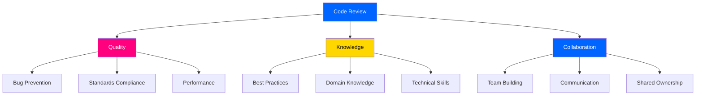
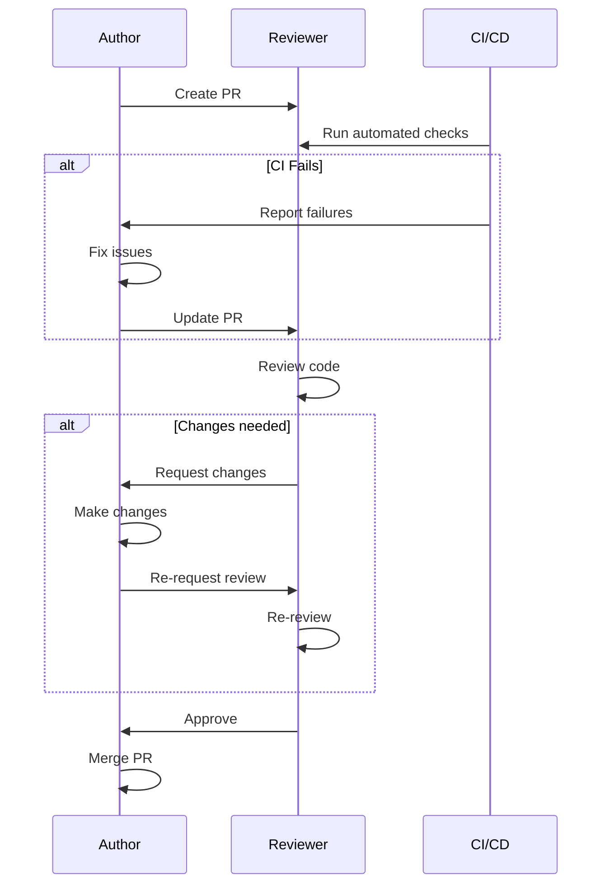

# CODE_REVIEW_GUIDE.md - Code Review Standards

---
title: 썸썸 (Thumb Some) - Code Review Guide
version: 1.0.0
status: Approved
owner: @development-team
created: 2025-12-01
updated: 2025-12-01
reviewers: [@lead-developer]
---

## 변경 이력 (Changelog)

| 버전 | 날짜 | 작성자 | 변경 내용 |
|------|------|--------|----------|
| 1.0.0 | 2025-12-01 | @development-team | 최초 작성 |

## 관련 문서

- [CONTRIBUTING.md](./CONTRIBUTING.md) - Contribution Guidelines
- [CONTEXT.md](./CONTEXT.md) - Project Context
- [VERSIONING_GUIDE.md](./VERSIONING_GUIDE.md) - Git Version Management

---

## 📑 Table of Contents

1. [Purpose](#purpose)
2. [Review Philosophy](#review-philosophy)
3. [Review Process](#review-process)
4. [Comprehensive Checklist](#comprehensive-checklist)
5. [Review Guidelines](#review-guidelines)
6. [Common Patterns](#common-patterns)
7. [Review Tools](#review-tools)
8. [Examples](#examples)

---

## 1. Purpose

### 1.1 Why Code Review?

**품질 보장** 🎯
- 버그 조기 발견
- 코드 표준 준수
- 아키텍처 일관성 유지

**지식 공유** 📚
- 팀원 간 코드 이해도 향상
- 베스트 프랙티스 전파
- 도메인 지식 공유

**멘토링** 👨‍🏫
- 주니어 개발자 성장
- 코드 스타일 학습
- 기술적 의사결정 배우기

### 1.2 Goals



---

## 2. Review Philosophy

### 2.1 Core Principles

**Be Kind** 💝
- 코드를 비판하되, 사람을 비판하지 않습니다
- 건설적인 피드백을 제공합니다
- 긍정적인 부분도 언급합니다

**Be Thorough** 🔍
- 꼼꼼하게 검토합니다
- 엣지 케이스를 고려합니다
- 큰 그림과 세부사항 모두 봅니다

**Be Timely** ⏰
- 48시간 이내에 첫 리뷰를 완료합니다
- 빠른 피드백이 더 나은 코드를 만듭니다

**Be Educational** 📖
- "왜"를 설명합니다
- 대안을 제시합니다
- 학습 자료를 공유합니다

### 2.2 Review Attitude

**좋은 리뷰어** ✅:

```markdown
💬 "이 함수가 20줄이 넘어서 읽기 어렵네요.
`_validateInput()`, `_processData()`, `_updateState()`로
분리하면 어떨까요? Clean Code 6장을 참고해보세요:
https://example.com/clean-code-functions"

👍 "이 에러 핸들링이 정말 세밀하네요!
각 예외 타입별로 적절히 처리하고 있어서 좋습니다."
```

**나쁜 리뷰어** ❌:

```markdown
❌ "이 코드 왜 이렇게 짰어요? 다시 하세요."

❌ "이건 안 됩니다." (이유 없음)

❌ "제 스타일이 아니네요." (주관적)
```

---

## 3. Review Process

### 3.1 Review Flow



### 3.2 Review Steps

**1️⃣ Quick Scan (5분)**

```markdown
- [ ] PR 제목과 설명이 명확한가?
- [ ] 변경 범위가 적절한가? (500줄 이하 권장)
- [ ] CI가 통과했는가?
- [ ] 테스트가 포함되어 있는가?
```

**2️⃣ Functionality Review (15분)**

```markdown
- [ ] 코드가 요구사항을 충족하는가?
- [ ] 엣지 케이스를 처리하는가?
- [ ] 에러 핸들링이 적절한가?
- [ ] 성능 이슈가 없는가?
```

**3️⃣ Code Quality Review (15분)**

```markdown
- [ ] 코드 스타일을 준수하는가?
- [ ] 네이밍이 명확한가?
- [ ] 중복 코드가 없는가?
- [ ] 주석이 적절한가?
```

**4️⃣ Architecture Review (10분)**

```markdown
- [ ] 아키텍처 원칙을 따르는가?
- [ ] 의존성 방향이 올바른가?
- [ ] 적절한 계층에 위치하는가?
```

### 3.3 Review Size Guidelines

| Size | Lines Changed | Time Estimate | Recommendation |
|------|---------------|---------------|----------------|
| **Tiny** | 1-50 | 5-10분 | ✅ Ideal |
| **Small** | 51-200 | 15-30분 | ✅ Good |
| **Medium** | 201-500 | 30-60분 | ⚠️ Consider splitting |
| **Large** | 501-1000 | 1-2시간 | ❌ Should split |
| **Huge** | 1000+ | 2시간+ | 🚫 Must split |

**Large PR 처리 방법**:

```bash
# ❌ BAD: Single huge PR
feature/soul-sync-complete (1500 lines)

# ✅ GOOD: Split into smaller PRs
feature/soul-sync-1-models (150 lines)
feature/soul-sync-2-ui (250 lines)
feature/soul-sync-3-logic (200 lines)
feature/soul-sync-4-integration (100 lines)
```

---

## 4. Comprehensive Checklist

### 4.1 Functionality ⚙️

```markdown
## Functionality Review

### Core Requirements
- [ ] 코드가 PR 설명의 요구사항을 충족하는가?
- [ ] 관련 이슈의 acceptance criteria를 만족하는가?
- [ ] 기능이 의도한 대로 동작하는가?

### Edge Cases
- [ ] Null/undefined 입력 처리
- [ ] 빈 배열/리스트 처리
- [ ] 네트워크 실패 시나리오
- [ ] 동시성 문제 (race condition)
- [ ] 메모리 제약 상황

### Error Handling
- [ ] 모든 예외가 적절히 처리되는가?
- [ ] 에러 메시지가 명확한가?
- [ ] 사용자에게 적절한 피드백이 제공되는가?
- [ ] 에러 로그가 충분한가?

### Example Questions:
- "사용자가 2명이 아니라 1명만 터치하면 어떻게 되나요?"
- "네트워크가 끊겼을 때 앱이 크래시하지 않나요?"
- "메모리가 부족한 기기에서도 동작하나요?"
```

### 4.2 Code Quality 🎨

```markdown
## Code Quality Review

### Readability
- [ ] 변수/함수 이름이 의도를 명확히 드러내는가?
- [ ] 코드 구조가 이해하기 쉬운가?
- [ ] 복잡한 로직에 주석이 있는가?
- [ ] 매직 넘버가 상수로 추출되었는가?

### Simplicity
- [ ] 함수가 20줄 이하인가?
- [ ] 클래스가 200줄 이하인가?
- [ ] 중첩 깊이가 3단계 이하인가?
- [ ] 파라미터가 4개 이하인가?

### DRY (Don't Repeat Yourself)
- [ ] 중복 코드가 없는가?
- [ ] 공통 로직이 추출되었는가?
- [ ] 유틸리티 함수가 재사용되는가?

### SOLID Principles
- [ ] Single Responsibility: 하나의 책임만 가지는가?
- [ ] Open/Closed: 확장에 열려있고 수정에 닫혀있는가?
- [ ] Liskov Substitution: 대체 가능한가?
- [ ] Interface Segregation: 인터페이스가 분리되었는가?
- [ ] Dependency Inversion: 추상에 의존하는가?
```

**Example - SRP Violation**:

```dart
// ❌ BAD: Multiple responsibilities
class GameScreen extends StatefulWidget {
  // UI rendering
  // Game logic
  // Network calls
  // Data persistence
  // Analytics
}

// ✅ GOOD: Separated responsibilities
class GameScreen extends StatefulWidget {
  // Only UI rendering
  final GameLogic gameLogic;
  final AnalyticsService analytics;
  final GameRepository repository;
}

class GameLogic {
  // Only game business logic
}
```

### 4.3 Design & Architecture 🏗️

```markdown
## Architecture Review

### Layer Separation
- [ ] Presentation/Business/Data 계층이 명확히 분리되었는가?
- [ ] 의존성 방향이 올바른가? (Presentation → Business → Data)
- [ ] 계층 간 경계가 명확한가?

### State Management
- [ ] 상태 관리가 적절한가? (setState vs Riverpod)
- [ ] 상태 변경이 예측 가능한가?
- [ ] 불필요한 리빌드가 없는가?

### Dependency Injection
- [ ] 의존성이 주입되는가? (하드코딩 금지)
- [ ] 테스트 가능한 구조인가?
- [ ] Mock 객체로 대체 가능한가?
```

**Example - Clean Architecture**:

```dart
// ✅ GOOD: Clean Architecture
// Presentation Layer
class GameScreen extends ConsumerWidget {
  @override
  Widget build(BuildContext context, WidgetRef ref) {
    final gameState = ref.watch(gameStateProvider);
    // UI rendering only
  }
}

// Business Layer
class GameStateNotifier extends StateNotifier<GameState> {
  final GameRepository _repository;

  GameStateNotifier(this._repository) : super(GameState.initial());

  void startGame() {
    // Business logic only
  }
}

// Data Layer
class GameRepository {
  final RemoteDataSource _remote;
  final LocalDataSource _local;

  Future<GameData> fetchGameData() {
    // Data fetching only
  }
}
```

### 4.4 Performance ⚡

```markdown
## Performance Review

### Widget Performance
- [ ] `const` 생성자를 사용했는가?
- [ ] 불필요한 리빌드가 없는가?
- [ ] `ListView.builder` 등 lazy loading을 사용했는가?
- [ ] 큰 리스트를 효율적으로 렌더링하는가?

### Memory Management
- [ ] 메모리 누수가 없는가?
- [ ] Stream/Controller가 dispose되는가?
- [ ] 큰 객체가 적절히 해제되는가?

### Network
- [ ] 불필요한 API 호출이 없는가?
- [ ] 캐싱을 활용하는가?
- [ ] 요청이 병렬로 처리되는가?

### Database
- [ ] 인덱스가 적절히 사용되는가?
- [ ] N+1 쿼리 문제가 없는가?
- [ ] 트랜잭션이 적절한가?
```

**Example - Performance Issue**:

```dart
// ❌ BAD: Rebuilds entire list
class GameList extends StatelessWidget {
  @override
  Widget build(BuildContext context) {
    return ListView(
      children: gameItems.map((item) {
        return ExpensiveWidget(item);  // All widgets rebuild
      }).toList(),
    );
  }
}

// ✅ GOOD: Only rebuilds visible items
class GameList extends StatelessWidget {
  @override
  Widget build(BuildContext context) {
    return ListView.builder(
      itemCount: gameItems.length,
      itemBuilder: (context, index) {
        return ExpensiveWidget(gameItems[index]);  // Only visible items
      },
    );
  }
}
```

### 4.5 Security 🔒

```markdown
## Security Review

### Input Validation
- [ ] 모든 사용자 입력이 검증되는가?
- [ ] SQL Injection 방어가 되는가?
- [ ] XSS 방어가 되는가?

### Authentication & Authorization
- [ ] 인증이 적절히 구현되었는가?
- [ ] 권한 체크가 올바른가?
- [ ] 토큰이 안전하게 저장되는가?

### Data Protection
- [ ] 민감한 정보가 하드코딩되지 않았는가?
- [ ] API 키가 환경변수로 관리되는가?
- [ ] 로그에 민감한 정보가 출력되지 않는가?

### OWASP Top 10
- [ ] Injection 취약점이 없는가?
- [ ] Broken Authentication이 없는가?
- [ ] Sensitive Data Exposure가 없는가?
- [ ] XML External Entities (XXE)가 없는가?
- [ ] Broken Access Control이 없는가?
```

**Example - Security Violation**:

```dart
// ❌ BAD: Hardcoded secret
class ApiClient {
  static const apiKey = 'sk-1234567890abcdef';  // NEVER DO THIS!
}

// ✅ GOOD: Environment variable
class ApiClient {
  final String apiKey;

  ApiClient({required this.apiKey});

  factory ApiClient.fromEnv() {
    return ApiClient(
      apiKey: dotenv.env['API_KEY'] ?? '',
    );
  }
}
```

### 4.6 Testing ✅

```markdown
## Testing Review

### Test Coverage
- [ ] 주요 로직에 유닛 테스트가 있는가?
- [ ] 엣지 케이스 테스트가 있는가?
- [ ] 위젯 테스트가 포함되었는가? (UI 변경 시)

### Test Quality
- [ ] 테스트가 독립적인가? (다른 테스트에 의존하지 않음)
- [ ] 테스트가 결정적인가? (항상 같은 결과)
- [ ] 테스트가 빠른가? (1초 이내)
- [ ] 테스트 이름이 명확한가?

### Test Structure (AAA Pattern)
- [ ] Arrange: 준비가 명확한가?
- [ ] Act: 실행이 명확한가?
- [ ] Assert: 검증이 명확한가?
```

**Example - Test Structure**:

```dart
// ✅ GOOD: Clear AAA pattern
test('should calculate score correctly when all answers match', () {
  // Arrange
  final calculator = ScoreCalculator();
  final answers = [
    Answer(userA: true, userB: true),
    Answer(userA: false, userB: false),
    Answer(userA: true, userB: true),
  ];

  // Act
  final score = calculator.calculate(answers);

  // Assert
  expect(score, equals(100));
});
```

### 4.7 Documentation 📝

```markdown
## Documentation Review

### Code Documentation
- [ ] 공개 API에 Dartdoc이 있는가?
- [ ] 복잡한 로직에 주석이 있는가?
- [ ] TODO/FIXME가 적절한가?

### Project Documentation
- [ ] README가 업데이트되었는가? (필요 시)
- [ ] CONTEXT.md가 업데이트되었는가? (아키텍처 변경 시)
- [ ] API_SPEC.md가 업데이트되었는가? (API 변경 시)

### Comments Quality
- [ ] 주석이 "왜"를 설명하는가? ("무엇"이 아닌)
- [ ] 주석이 최신인가? (코드와 일치)
- [ ] 불필요한 주석이 제거되었는가?
```

**Example - Good vs Bad Comments**:

```dart
// ❌ BAD: States the obvious
// 게임을 시작합니다
void startGame() { ... }

// ✅ GOOD: Explains why
// 햅틱 피드백 전에 0.5초 대기하여 이전 진동이 완료되도록 합니다.
// iOS에서는 연속 햅틱 호출 시 첫 번째만 동작하는 이슈가 있음.
await Future.delayed(Duration(milliseconds: 500));
HapticFeedback.heavyImpact();

// ✅ GOOD: Explains complex algorithm
// Sin/Cos 조합으로 8자 경로를 생성합니다.
// targetA는 sin(t * 1.5), targetB는 cos(t * 1.8)로 위상을 다르게하여
// 두 캐릭터의 경로가 교차하도록 유도합니다.
```

### 4.8 Git & Commits 📦

```markdown
## Git Review

### Commit Messages
- [ ] 커밋 메시지가 Conventional Commits을 따르는가?
- [ ] 커밋 메시지가 명확한가?
- [ ] 각 커밋이 논리적 단위인가?

### Branch Management
- [ ] 브랜치 이름이 규칙을 따르는가?
- [ ] 브랜치가 최신 main 기준인가?
- [ ] 머지 충돌이 없는가?

### Code History
- [ ] WIP 커밋이 제거되었는가?
- [ ] Squash가 필요한가?
- [ ] 커밋 히스토리가 깨끗한가?
```

---

## 5. Review Guidelines

### 5.1 How to Give Feedback

**Feedback Levels**:

| Level | Icon | Meaning | Action Required |
|-------|------|---------|-----------------|
| **Critical** | 🚨 | Must fix | Blocks merge |
| **Major** | ⚠️ | Should fix | Strongly recommended |
| **Minor** | 💡 | Nice to have | Optional |
| **Praise** | 👍 | Good work | No action |
| **Question** | ❓ | Clarification | Answer requested |

**Example Feedback**:

```markdown
🚨 **Critical**: 이 코드는 null pointer exception을 발생시킬 수 있습니다.
`user.name`을 사용하기 전에 `user != null`을 체크해주세요.

⚠️ **Major**: 이 함수가 50줄이 넘어서 읽기 어렵습니다.
로직을 `_validate()`, `_process()`, `_save()`로 분리하는 것을 권장합니다.

💡 **Minor**: `const` 생성자를 사용하면 성능이 약간 개선될 수 있습니다.

👍 **Praise**: 에러 핸들링이 정말 세밀하네요!
각 케이스별로 적절한 메시지를 제공하고 있어서 좋습니다.

❓ **Question**: 이 로직이 정확히 어떤 케이스를 처리하는 건가요?
주석을 추가하면 이해하기 더 쉬울 것 같습니다.
```

### 5.2 Review Template

```markdown
## Review Summary

### Overview
[전체적인 인상을 한 줄로]

### 👍 Strengths
- [잘된 부분 1]
- [잘된 부분 2]

### 🚨 Critical Issues
- [ ] [반드시 수정해야 할 이슈 1]
- [ ] [반드시 수정해야 할 이슈 2]

### ⚠️ Major Suggestions
- [ ] [강력히 권장하는 개선사항 1]
- [ ] [강력히 권장하는 개선사항 2]

### 💡 Minor Suggestions
- [선택적 개선사항 1]
- [선택적 개선사항 2]

### ❓ Questions
- [궁금한 점 1]
- [궁금한 점 2]

### Decision
- [ ] ✅ Approve
- [ ] 🔄 Request Changes
- [ ] 💬 Comment
```

### 5.3 Response Time SLA

| PR Size | First Review | Follow-up Review | Approval |
|---------|-------------|------------------|----------|
| **Tiny** (1-50 lines) | 4시간 | 2시간 | 즉시 |
| **Small** (51-200 lines) | 24시간 | 12시간 | 즉시 |
| **Medium** (201-500 lines) | 48시간 | 24시간 | 24시간 |
| **Large** (500+ lines) | 72시간 | 48시간 | 48시간 |

---

## 6. Common Patterns

### 6.1 Anti-Patterns to Watch For

**🚨 God Class**:

```dart
// ❌ BAD: Does everything
class GameManager {
  void startGame() { ... }
  void updateUI() { ... }
  void saveData() { ... }
  void sendAnalytics() { ... }
  void playSound() { ... }
  void showAd() { ... }
  // 300+ lines...
}
```

**🚨 Magic Numbers**:

```dart
// ❌ BAD
if (progress > 0.75) { ... }  // What does 0.75 mean?
await Future.delayed(Duration(milliseconds: 200));  // Why 200?

// ✅ GOOD
const double successThreshold = 0.75;  // 75% progress required for success
const int hapticDelayMs = 200;  // iOS haptic feedback spacing
```

**🚨 Callback Hell**:

```dart
// ❌ BAD
loadUser((user) {
  loadProfile(user.id, (profile) {
    loadPosts(profile.id, (posts) {
      updateUI(posts, () {
        showSuccess();
      });
    });
  });
});

// ✅ GOOD with async/await
final user = await loadUser();
final profile = await loadProfile(user.id);
final posts = await loadPosts(profile.id);
await updateUI(posts);
showSuccess();
```

### 6.2 Best Practices to Look For

**✅ Immutability**:

```dart
// ✅ GOOD
class GameState {
  final bool isPlaying;
  final double progress;

  const GameState({
    required this.isPlaying,
    required this.progress,
  });

  GameState copyWith({
    bool? isPlaying,
    double? progress,
  }) {
    return GameState(
      isPlaying: isPlaying ?? this.isPlaying,
      progress: progress ?? this.progress,
    );
  }
}
```

**✅ Null Safety**:

```dart
// ✅ GOOD
String? getUserName(User? user) {
  return user?.profile?.name ?? 'Anonymous';
}

// ❌ BAD
String getUserName(dynamic user) {
  return user.profile.name;  // Potential null crash
}
```

---

## 7. Review Tools

### 7.1 GitHub Features

**코드 제안**:

```dart
// Reviewer can suggest code directly
```suggestion
// Original code
if (user != null && user.name != null) {
  print(user.name);
}

// Suggested improvement
print(user?.name ?? 'Anonymous');
```

**라인별 코멘트**:
- 특정 라인에 직접 코멘트
- 여러 라인을 선택하여 블록 코멘트

**Review Status**:
- 💬 Comment: 일반적인 피드백
- ✅ Approve: 승인
- 🔄 Request Changes: 수정 요청

### 7.2 Automated Tools

**CI/CD Integration**:

```yaml
# .github/workflows/ci.yml
name: CI

on: [pull_request]

jobs:
  code-quality:
    runs-on: ubuntu-latest
    steps:
      - uses: actions/checkout@v3

      - name: Setup Flutter
        uses: subosito/flutter-action@v2

      - name: Install dependencies
        run: flutter pub get

      - name: Analyze
        run: flutter analyze

      - name: Format check
        run: dart format --set-exit-if-changed .

      - name: Run tests
        run: flutter test --coverage
```

---

## 8. Examples

### 8.1 Example Review - Good PR

**PR**: `feat(game): add difficulty selection`

**Review**:

```markdown
## Review Summary

### Overview
난이도 선택 기능이 깔끔하게 구현되었습니다! 👍

### 👍 Strengths
- 코드 구조가 명확하고 읽기 쉽습니다
- 테스트 커버리지가 우수합니다 (90%+)
- Dartdoc이 잘 작성되어 있습니다
- 에러 케이스를 꼼꼼하게 처리했습니다

### 💡 Minor Suggestions

**lib/features/game/models/difficulty.dart:15**
💡 `const` 생성자를 사용하면 약간의 성능 개선이 가능합니다:

```suggestion
const Difficulty({
  required this.baseIntensity,
  required this.scaleFactor,
});
```

**lib/features/game/game_screen.dart:45**
💡 매직 넘버를 상수로 추출하면 더 명확할 것 같습니다:

```dart
static const double easyIntensity = 0.5;
static const double normalIntensity = 1.0;
static const double hardIntensity = 1.5;
```

### ❓ Questions

**lib/features/game/game_logic.dart:78**
❓ `intensity > 3.0`일 때의 동작은 의도한 것인가요?
매우 어려운 난이도라면 캡을 두는 것이 좋을 것 같습니다.

### Decision
✅ **Approved with minor suggestions**

사소한 개선사항들이 있지만, 전체적으로 훌륭한 코드입니다!
Minor suggestions는 선택사항이므로, 원하시면 후속 PR로 처리해도 됩니다.

Great work! 🎉
```

### 8.2 Example Review - PR Needs Changes

**PR**: `feat(api): add user authentication`

**Review**:

```markdown
## Review Summary

### Overview
인증 로직의 기본 구조는 좋지만, 보안과 에러 핸들링 측면에서 개선이 필요합니다.

### 👍 Strengths
- JWT 토큰 관리 로직이 잘 구현되어 있습니다
- 코드 구조가 클린 아키텍처를 따르고 있습니다

### 🚨 Critical Issues

**lib/services/auth_service.dart:23**
🚨 **Critical**: API 키가 하드코딩되어 있습니다. 보안 위험!

```dart
// ❌ Current
static const apiKey = 'sk-1234567890abcdef';

// ✅ Should be
final apiKey = dotenv.env['API_KEY'] ?? '';
```

**lib/services/auth_service.dart:45**
🚨 **Critical**: 에러 핸들링이 누락되어 앱 크래시 가능성이 있습니다.

```dart
// ❌ Current
final response = await http.post(url);
return response.body;

// ✅ Should be
try {
  final response = await http.post(url);
  if (response.statusCode == 200) {
    return response.body;
  } else {
    throw AuthenticationException('Login failed');
  }
} on SocketException {
  throw NetworkException('Network error');
} catch (e) {
  throw AuthenticationException('Unexpected error: $e');
}
```

### ⚠️ Major Suggestions

**test/services/auth_service_test.dart**
⚠️ **Major**: 테스트가 누락되어 있습니다. 다음 케이스를 추가해주세요:
- [ ] 성공 케이스
- [ ] 잘못된 크레덴셜
- [ ] 네트워크 에러
- [ ] 토큰 만료

### Decision
🔄 **Request Changes**

Critical 이슈들을 수정한 후 다시 리뷰 요청해주세요.
질문 있으시면 언제든 코멘트 남겨주세요! 💪
```

---

## 9. Review Etiquette

### 9.1 Do's ✅

- **구체적으로**: "이 함수는 복잡합니다" ❌ → "이 함수가 20줄을 넘어서 `_validate()`와 `_process()`로 분리를 권장합니다" ✅
- **이유 설명**: "이렇게 하세요" ❌ → "이렇게 하면 테스트가 쉬워집니다" ✅
- **대안 제시**: "안 됩니다" ❌ → "이 방법 대신 이렇게 하면 어떨까요?" ✅
- **긍정적 피드백**: 잘된 부분도 언급하기

### 9.2 Don'ts ❌

- **절대적 표현 피하기**: "이건 틀렸어요" ❌ → "이 부분이 개선될 수 있을 것 같습니다" ✅
- **개인 공격 금지**: "왜 이렇게 짰어요?" ❌
- **주관적 의견 강요**: "제 스타일이 아니네요" ❌
- **과도한 nitpicking**: 사소한 것에 집착하지 않기

---

## 10. Quick Reference

### 10.1 Review Checklist (TL;DR)

```markdown
## Quick Checklist

### Automated ✅
- [ ] CI passed
- [ ] Tests passed
- [ ] Linter passed
- [ ] Format check passed

### Manual 👀
- [ ] Code works correctly
- [ ] Error handling adequate
- [ ] Performance acceptable
- [ ] Security concerns addressed
- [ ] Tests included
- [ ] Documentation updated
```

### 10.2 Review Commands

```bash
# Checkout PR branch locally
gh pr checkout [PR_NUMBER]

# Run tests
flutter test

# Check formatting
dart format --set-exit-if-changed .

# Analyze code
flutter analyze

# View diff
git diff main...HEAD
```

---

## 11. Resources

### 11.1 External Resources

- **Clean Code** by Robert C. Martin
- **Effective Dart**: https://dart.dev/guides/language/effective-dart
- **Flutter Best Practices**: https://docs.flutter.dev/development/best-practices
- **SOLID Principles**: https://en.wikipedia.org/wiki/SOLID

### 11.2 Internal Resources

- [CONTEXT.md](./CONTEXT.md) - Project architecture
- [CONTRIBUTING.md](./CONTRIBUTING.md) - How to contribute
- [VERSIONING_GUIDE.md](./VERSIONING_GUIDE.md) - Git workflow

---

**Happy Reviewing!** 🎉

**Last Updated**: 2025-12-01
**Version**: 1.0.0
**Status**: ✅ Approved
