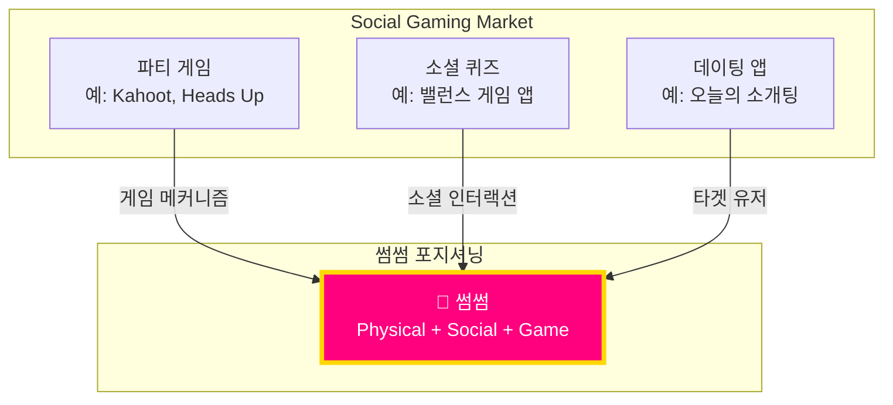
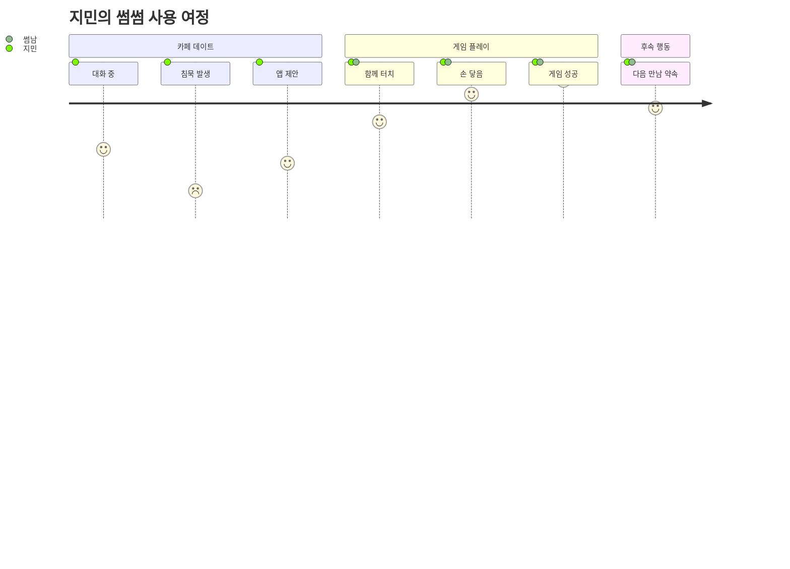
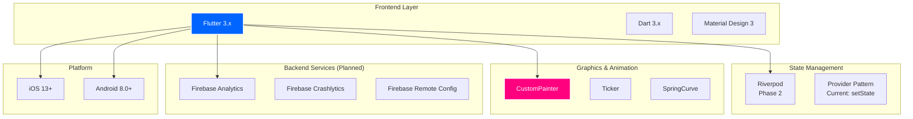
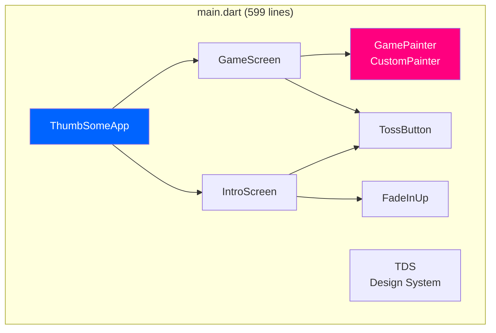
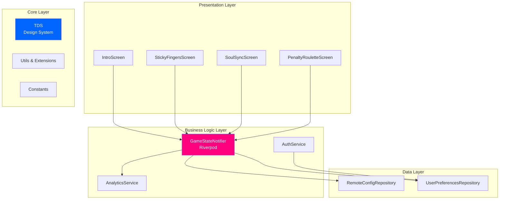
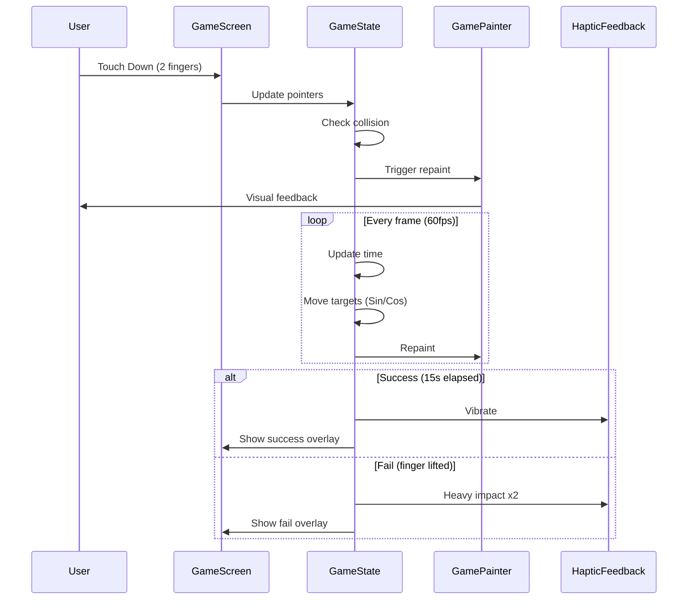
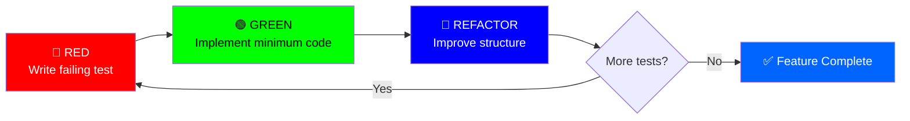
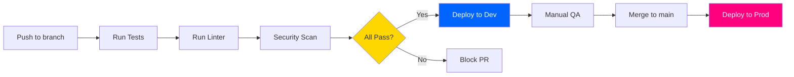

# CONTEXT.md - Project Single Source of Truth

---
title: 썸썸 (Thumb Some) - Project Context
version: 1.0.0
status: Approved
owner: @development-team
created: 2025-12-01
updated: 2025-12-01
reviewers: [@lead-developer]
---

## 변경 이력 (Changelog)

| 버전 | 날짜 | 작성자 | 변경 내용 |
|------|------|--------|----------|
| 1.0.0 | 2025-12-01 | @development-team | 최초 작성 (Claude.md 통합 및 확장) |

## 관련 문서

- [PRD.md](./PRD.md) - Product Requirements Document
- [plan.md](./plan.md) - Development Roadmap
- [ENVIRONMENT.md](./ENVIRONMENT.md) - Development Environment Setup
- [README.md](./README.md) - Quick Start Guide

---

## 📑 Table of Contents

1. [Executive Summary](#executive-summary)
2. [Business Context](#business-context)
3. [Technical Context](#technical-context)
4. [System Architecture](#system-architecture)
5. [Development Principles](#development-principles)
6. [Project Structure](#project-structure)
7. [Key Design Decisions](#key-design-decisions)
8. [Development Workflow](#development-workflow)
9. [Quality Standards](#quality-standards)
10. [Glossary](#glossary)

---

## 1. Executive Summary

### 1.1 Project Identity

**Project Name**: 썸썸 (Thumb Some)
**Tagline**: "게임인 척하며 자연스럽게 손잡기"
**Version**: 1.0.0-MVP
**Current Phase**: MVP Complete → Phase 2 Planning

### 1.2 Vision Statement

> 스킨십을 게임 메커니즘의 필수 요소로 만들어, 썸 단계 커플과 소개팅 상황에서 자연스러운 신체 접촉을 유도하는 하이퍼 캐주얼 소셜 인터랙티브 앱

### 1.3 Core Value Proposition

**Problem**: 썸 단계에서 스킨십 진도를 나가고 싶지만 명분이 없어 어색함

**Solution**: 두 사람이 스마트폰 화면을 함께 터치해야 하는 게임으로 스킨십을 게임 규칙의 일부로 만들고, B급 감성으로 민망함 해소

**Unique Mechanism**:
- 멀티터치 기반 협동 게임
- 물리적 접촉이 게임 승리의 필수 조건
- 실패 시 벌칙을 통한 추가 인터랙션 유도

### 1.4 Target Metrics (Phase 2 Goal)

| Metric | Target | Measurement |
|--------|--------|-------------|
| **MAU** | 10,000+ (3개월 후) | Firebase Analytics |
| **Session Length** | 5분+ | 평균 게임 플레이 시간 |
| **D7 Retention** | 40%+ | 7일 후 재방문율 |
| **Virality** | 30%+ | 친구 초대율 |
| **App Store Rating** | 4.5+ | iOS/Android 평점 |
| **Crash Rate** | <1% | Firebase Crashlytics |

---

## 2. Business Context

### 2.1 Market Positioning



**차별화 포인트**:
1. **유일한 스킨십 강제 메커니즘** - 경쟁 앱 없음
2. **B급 감성** - 진지하지 않아 심리적 장벽 낮음
3. **개발자 페르소나 활용** - "내가 만든 앱 테스트 해줘" 자연스러운 접근

### 2.2 User Personas

#### Primary Persona: "썸타는 지민" (25세, 여성)

```
┌─────────────────────────────────────────┐
│ 👤 지민                                  │
│ 25세, 직장인, 3번째 데이트               │
├─────────────────────────────────────────┤
│ Pain Points:                            │
│ • 대화 소재 떨어지면 어색함              │
│ • 손 잡고 싶지만 먼저 잡기엔 오글거림    │
│                                         │
│ Goals:                                  │
│ • 자연스럽게 분위기 만들기               │
│ • 상대방 반응 살피기                     │
│                                         │
│ 썸썸 사용 시나리오:                       │
│ "재미있는 앱 발견했는데 같이 해볼래?"    │
│ → 게임 중 자연스러운 스킨십              │
│ → 실패 시 "10초 눈맞춤" 벌칙             │
└─────────────────────────────────────────┘
```

**User Journey**:



### 2.3 Business Model (Phase 3)

| 수익 모델 | 상품 | 가격 | 목표 전환율 |
|----------|------|------|------------|
| **IAP** | 화끈한 매운맛 팩 | $0.99 | 5% |
| **Subscription** | 프리미엄 (월간) | $2.99 | 2% |
| **Ads** | Interstitial (3회 실패 후) | CPM $5 | - |

**목표 ARPU**: $0.50 (Phase 3 6개월 후)

---

## 3. Technical Context

### 3.1 Tech Stack Overview



### 3.2 Technology Selection Rationale

| Component | Choice | Alternative Considered | Reason |
|-----------|--------|----------------------|--------|
| **Framework** | Flutter 3.x | React Native, Native | Single codebase, 60fps guarantee |
| **Language** | Dart 3.x | Kotlin/Swift | Type-safe, JIT/AOT compilation |
| **Graphics** | CustomPainter | Game Engine (Unity) | 가벼움, 오버헤드 없음 |
| **State Mgmt** | Riverpod (planned) | Bloc, GetX | Provider보다 안전, 테스트 용이 |
| **Backend** | Firebase | Supabase, AWS | 빠른 프로토타이핑, 무료 티어 |

### 3.3 Performance Requirements

| Requirement | Target | Current Status | Measurement Tool |
|-------------|--------|----------------|------------------|
| **Frame Rate** | 60fps (120fps on ProMotion) | ✅ 60fps+ | Flutter DevTools |
| **App Size** | <10MB | ✅ ~5MB (MVP) | Build artifacts |
| **Cold Start** | <2s | ✅ ~1s | Xcode Instruments |
| **Memory Usage** | <100MB | ✅ ~60MB | Memory Profiler |
| **Battery Drain** | <5% per 10min | ⚠️ Needs Testing | Battery Usage |

---

## 4. System Architecture

### 4.1 Current Architecture (MVP)

**Architecture Pattern**: Monolithic Single-File



**Rationale**:
- 빠른 프로토타이핑
- 복잡도 최소화
- 전체 로직 한눈에 파악 가능

### 4.2 Target Architecture (Phase 2)

**Architecture Pattern**: Clean Architecture (Layered)



**Migration Strategy**: 점진적 리팩토링 (Sprint 4)
1. TDS 분리 → `lib/core/design_system/tds.dart`
2. 위젯 분리 → `lib/shared/widgets/`
3. 게임 로직 분리 → `lib/features/sticky_fingers/game_logic.dart`
4. Riverpod 도입 → `lib/providers/`

### 4.3 Data Flow (Current MVP)



---

## 5. Development Principles

### 5.1 Core Principles

#### Principle 1: TDD-First (Phase 2+)

**정의**: 테스트로 행동을 정의하고, 코드로 구현한다.

```dart
// ✅ EXAMPLE: TDD Cycle for TDS Color Validation

// 1️⃣ RED: Write failing test
void main() {
  group('TDS Colors', () {
    test('should have valid hex color format', () {
      // Given
      final primaryBlue = TDS.primaryBlue;

      // When
      final hexString = primaryBlue.value.toRadixString(16).padLeft(8, '0');

      // Then
      expect(hexString, matches(r'^[0-9a-f]{8}$'));
    });

    test('should match design spec color values', () {
      // Given & When
      final primaryBlue = TDS.primaryBlue;

      // Then
      expect(primaryBlue.value, equals(0xFF0064FF));
    });
  });
}

// 2️⃣ GREEN: Implement to pass
class TDS {
  static const Color primaryBlue = Color(0xFF0064FF);
}

// 3️⃣ REFACTOR: Extract to separate file
// lib/core/design_system/tds.dart
```

#### Principle 2: Clean Code

**핵심 규칙**:

| 규칙 | 기준 | 위반 시 조치 |
|------|------|-------------|
| **Single Responsibility** | 1 class = 1 reason to change | 클래스 분리 |
| **Naming** | 의도를 드러내는 이름 | 리네이밍 |
| **Function Length** | 20줄 이하 | 함수 추출 |
| **Magic Numbers** | 상수로 추출 | Named constant |
| **Comments** | 코드로 설명 안 되는 것만 | 불필요 주석 제거 |

**예시**:

```dart
// ❌ BAD: Magic numbers, unclear intent
void _gameLoop(Duration elapsed) {
  _time += 0.016;
  if (_time > 15.0) {
    _finishGame(true);
  }
  targetA = Offset(
    centerX + sin(_time * 1.5) * 60,
    centerY + cos(_time * 2.1) * 100
  );
}

// ✅ GOOD: Named constants, clear structure
class GameConstants {
  static const double frameTime = 0.016; // 60fps
  static const double gameDuration = 15.0; // seconds
  static const double targetMovementRadiusX = 60.0;
  static const double targetMovementRadiusY = 100.0;
  static const double targetAFrequencyX = 1.5;
  static const double targetAFrequencyY = 2.1;
}

void _gameLoop(Duration elapsed) {
  _updateGameTime();

  if (_isGameComplete()) {
    _finishGame(success: true);
    return;
  }

  _updateTargetPositions();
}

void _updateGameTime() {
  _time += GameConstants.frameTime;
  progress = _time / GameConstants.gameDuration;
}

bool _isGameComplete() => progress >= 1.0;

void _updateTargetPositions() {
  targetA = _calculateTargetPosition(
    center: Offset(centerX, centerY),
    offset: const Offset(-80, 0),
    radiusX: GameConstants.targetMovementRadiusX,
    radiusY: GameConstants.targetMovementRadiusY,
    frequencyX: GameConstants.targetAFrequencyX,
    frequencyY: GameConstants.targetAFrequencyY,
  );
}
```

#### Principle 3: Git Discipline

**Commit Message Format**: Conventional Commits

```
<type>(<scope>): <subject>

[optional body]

[optional footer]
```

**Example**:

```bash
# ✅ GOOD
git commit -m "feat(game): add difficulty scaling based on progress

- Increase target speed from 1.0x to 3.0x
- Scale movement intensity with time
- Add visual indicator for difficulty level

Closes #23"

# ❌ BAD
git commit -m "update game"
```

**Commit Types**:

| Type | Description | Example |
|------|-------------|---------|
| `feat` | New feature | `feat(auth): add JWT refresh token` |
| `fix` | Bug fix | `fix(game): resolve touch detection on small screens` |
| `refactor` | Code restructuring | `refactor(tds): extract design system to separate file` |
| `test` | Add/modify tests | `test(game): add collision detection unit tests` |
| `docs` | Documentation | `docs(readme): update installation steps` |
| `chore` | Build/dependencies | `chore(deps): upgrade flutter to 3.16` |

### 5.2 Code Style Guide

**Dart Formatting**:

```bash
# Auto-format all files
dart format .

# Check formatting without changing files
dart format --set-exit-if-changed .
```

**Naming Conventions**:

| Element | Convention | Example |
|---------|-----------|---------|
| **Class** | PascalCase | `GameScreen`, `TossButton` |
| **Function** | camelCase | `startGame()`, `calculateScore()` |
| **Variable** | camelCase | `targetA`, `isPlaying` |
| **Private** | `_camelCase` | `_gameLoop()`, `_pointers` |
| **Constant** | camelCase | `gameDuration`, `targetRadius` |
| **File** | snake_case | `game_screen.dart`, `tds.dart` |

**Import Ordering**:

```dart
// 1. Dart SDK
import 'dart:async';
import 'dart:math';

// 2. Flutter SDK
import 'package:flutter/material.dart';
import 'package:flutter/services.dart';

// 3. External packages
import 'package:riverpod/riverpod.dart';

// 4. Internal packages (relative)
import '../core/design_system/tds.dart';
import '../shared/widgets/toss_button.dart';
```

---

## 6. Project Structure

### 6.1 Current Structure (MVP)

```
thumb-some/
├── main.dart                 # 전체 앱 코드 (599줄)
├── README.md                 # 프로젝트 소개
├── CONTEXT.md               # 이 문서
├── PRD.md                   # 제품 요구사항
├── plan.md                  # 개발 계획
├── Claude.md                # AI 개발 가이드 (deprecated)
├── pubspec.yaml             # 의존성 관리
└── .gitignore               # Git 제외 파일
```

### 6.2 Target Structure (Phase 2)

```
thumb-some/
├── lib/
│   ├── main.dart
│   ├── core/
│   │   ├── design_system/
│   │   │   ├── tds.dart
│   │   │   └── tds_test.dart
│   │   ├── constants/
│   │   │   └── game_constants.dart
│   │   └── utils/
│   │       ├── haptic_helper.dart
│   │       └── extensions.dart
│   ├── features/
│   │   ├── intro/
│   │   │   └── intro_screen.dart
│   │   ├── sticky_fingers/
│   │   │   ├── sticky_fingers_screen.dart
│   │   │   ├── game_logic.dart
│   │   │   ├── game_painter.dart
│   │   │   └── models/
│   │   │       └── game_state.dart
│   │   ├── soul_sync/
│   │   │   └── soul_sync_screen.dart
│   │   └── penalty_roulette/
│   │       └── penalty_roulette_screen.dart
│   ├── shared/
│   │   └── widgets/
│   │       ├── toss_button.dart
│   │       └── fade_in_up.dart
│   └── providers/
│       └── game_state_provider.dart
├── tests/
│   ├── unit/
│   │   ├── core/
│   │   └── features/
│   ├── widget/
│   └── integration/
├── docs/
│   ├── specs/
│   │   ├── ARCHITECTURE.md
│   │   └── API_SPEC.md
│   └── guides/
│       └── TDD_GUIDE.md
├── .github/
│   ├── workflows/
│   │   └── ci.yml
│   └── ISSUE_TEMPLATE/
├── CONTEXT.md
├── ENVIRONMENT.md
├── README.md
├── PRD.md
├── plan.md
├── .env.example
└── .gitignore
```

---

## 7. Key Design Decisions

### 7.1 Design System: Toss Design System (TDS)

**Decision**: Toss 앱의 디자인 철학 차용 + 키치 핑크/옐로우 액센트

**Rationale**:
- 토스의 **직관성**과 **신뢰감** 활용
- 금융 앱의 안정감 + 게임의 경쾌함 조합
- 한국 사용자에게 익숙한 UX 패턴

**Color Palette**:

```dart
class TDS {
  // Base Colors (Toss)
  static const Color background = Color(0xFF17171C);
  static const Color card = Color(0xFF202632);
  static const Color primaryBlue = Color(0xFF0064FF);

  // Accent Colors (Kitsch)
  static const Color kitschPink = Color(0xFFFF007F);
  static const Color kitschYellow = Color(0xFFFFD700);

  // Text Colors
  static const Color textWhite = Color(0xFFFFFFFF);
  static const Color textGrey = Color(0xFF8B95A1);

  // Status Colors
  static const Color danger = Color(0xFFF04452);
}
```

**Usage Example**:

```dart
// Button
Container(
  decoration: BoxDecoration(
    color: TDS.primaryBlue,  // 신뢰감 있는 액션
    borderRadius: BorderRadius.circular(16),  // Toss corner radius
  ),
)

// Success feedback
Text(
  "천생연분!",
  style: TextStyle(color: TDS.kitschPink),  // 경쾌한 피드백
)
```

### 7.2 Game Physics: Sin/Cos 기반 8자 이동

**Decision**: Unity/Flame 같은 게임 엔진 대신 수학 함수로 직접 구현

**Algorithm**:

```dart
// 8자 모양을 만드는 Sin/Cos 조합
Offset calculateTargetPosition({
  required Offset center,
  required double time,
  required double intensity,
}) {
  return Offset(
    center.dx + sin(time * 1.5) * 60 * intensity,
    center.dy + cos(time * 2.1) * 100 * intensity,
  );
}
```

**Rationale**:
- **가벼움**: 게임 엔진 오버헤드 없음
- **제어 가능**: 물리 파라미터 직접 조정
- **60fps 보장**: Flutter의 Ticker와 완벽 호환

**Difficulty Scaling**:

```dart
double intensity = 1.0 + (progress * 2.0);
// progress 0% → intensity 1.0x (느림)
// progress 50% → intensity 2.0x (중간)
// progress 100% → intensity 3.0x (빠름)
```

### 7.3 Haptic Feedback Strategy

**Decision**: 게임 이벤트별 차별화된 햅틱 패턴

| Event | Haptic Type | Rationale |
|-------|-------------|-----------|
| **게임 시작** | Heavy Impact | 강한 시작 신호 |
| **1초마다 생존** | Light Impact | 심장 박동 느낌 |
| **성공** | Vibrate | 축하 느낌 (긴 진동) |
| **실패** | Heavy Impact x2 | 아쉬움 강조 |

**Implementation**:

```dart
import 'package:flutter/services.dart';

// Success
HapticFeedback.vibrate();

// Fail
HapticFeedback.heavyImpact();
await Future.delayed(Duration(milliseconds: 200));
HapticFeedback.heavyImpact();
```

**Testing Note**: ⚠️ 햅틱은 시뮬레이터에서 작동하지 않음. 반드시 실기기 테스트 필요.

---

## 8. Development Workflow

### 8.1 TDD Cycle (Phase 2+)



**Example: Adding Difficulty Selection**

```dart
// 🔴 RED: test/features/game/difficulty_test.dart
void main() {
  group('Difficulty Selection', () {
    test('should return correct intensity for easy difficulty', () {
      // Given
      final difficulty = Difficulty.easy;

      // When
      final intensity = difficulty.getIntensity(progress: 0.5);

      // Then
      expect(intensity, equals(0.75)); // 0.5 + (0.5 * 0.5)
    });
  });
}

// 🟢 GREEN: lib/features/sticky_fingers/models/difficulty.dart
enum Difficulty {
  easy(baseIntensity: 0.5, scaleFactor: 0.5),
  normal(baseIntensity: 1.0, scaleFactor: 1.0),
  hard(baseIntensity: 1.5, scaleFactor: 1.5);

  const Difficulty({
    required this.baseIntensity,
    required this.scaleFactor,
  });

  final double baseIntensity;
  final double scaleFactor;

  double getIntensity({required double progress}) {
    return baseIntensity + (progress * scaleFactor);
  }
}

// 🔵 REFACTOR: Extract to game_logic.dart, add validation
```

### 8.2 Branch Strategy

**Branch Naming**:

```
main                          # Production-ready code
├── develop                   # Integration branch
│   ├── feature/soul-sync     # New feature
│   ├── feature/roulette      # New feature
│   ├── fix/touch-detection   # Bug fix
│   └── refactor/architecture # Code restructure
```

**PR Process**:

1. **Create Branch**: `git checkout -b feature/soul-sync`
2. **Implement with TDD**: Red → Green → Refactor
3. **Commit**: Conventional commits
4. **Push**: `git push -u origin feature/soul-sync`
5. **Create PR**: Use template
6. **Code Review**: At least 1 approval
7. **Merge**: Squash and merge to `develop`

### 8.3 CI/CD Pipeline (Phase 2)



---

## 9. Quality Standards

### 9.1 Code Quality Metrics

| Metric | Target | Tool |
|--------|--------|------|
| **Test Coverage** | 80%+ | `flutter test --coverage` |
| **Lint Score** | 0 issues | `dart analyze` |
| **Code Complexity** | Cyclomatic < 10 | Manual review |
| **Performance** | 60fps+ | Flutter DevTools |

### 9.2 Code Review Checklist

```markdown
## Functionality
- [ ] 코드가 의도한 대로 동작하는가?
- [ ] 엣지 케이스가 처리되었는가?
- [ ] 테스트가 충분한가?

## Design
- [ ] 코드가 클린 아키텍처를 따르는가?
- [ ] 단일 책임 원칙을 준수하는가?
- [ ] 중복 코드가 없는가?

## Readability
- [ ] 변수/함수 이름이 명확한가?
- [ ] 주석이 필요한 곳에 적절히 있는가?
- [ ] 매직 넘버가 상수로 추출되었는가?

## Performance
- [ ] 불필요한 리빌드가 없는가?
- [ ] 메모리 누수 가능성이 없는가?
- [ ] 비동기 처리가 적절한가?

## Security
- [ ] 사용자 입력이 검증되는가?
- [ ] 민감 정보가 하드코딩되지 않았는가?
```

### 9.3 Testing Strategy

**Test Pyramid**:

```
        ┌─────────┐
        │   E2E   │  10% - Critical user flows
        ├─────────┤
        │  Widget │  20% - UI components
        ├─────────┤
        │  Unit   │  70% - Business logic
        └─────────┘
```

**Coverage Goals**:

| Layer | Target | Example |
|-------|--------|---------|
| **Unit Tests** | 80%+ | `game_logic_test.dart` |
| **Widget Tests** | 60%+ | `toss_button_test.dart` |
| **Integration Tests** | Critical Paths 100% | `game_flow_test.dart` |

---

## 10. Glossary

### 10.1 Domain Terms

| Term | Definition | Example |
|------|-----------|---------|
| **썸 (Some)** | 연애 전 단계의 미묘한 관계 | "우리 지금 썸 타는 중인가?" |
| **쫀드기** | "끈적이는" + "손가락"의 합성어 | 게임 모드 이름 |
| **띠로리~** | 실패를 표현하는 밈 | 게임 실패 시 표시 |
| **천생연분** | 하늘이 정한 인연 | 게임 성공 시 표시 |
| **러브샷** | 술잔을 팔로 엮어 마시는 행위 | 벌칙 프리셋 중 하나 |

### 10.2 Technical Terms

| Term | Definition | Code Reference |
|------|-----------|---------------|
| **TDS** | Toss Design System | `class TDS` |
| **CustomPainter** | Flutter의 Canvas API | `class GamePainter extends CustomPainter` |
| **Ticker** | Flutter의 애니메이션 프레임 콜백 | `createTicker(_gameLoop)` |
| **Haptic Feedback** | 촉각 피드백 | `HapticFeedback.vibrate()` |
| **Spring Curve** | 탄성 애니메이션 커브 | `Curves.elasticOut` |
| **Riverpod** | Flutter 상태 관리 라이브러리 (Phase 2) | - |

### 10.3 Acronyms

| Acronym | Full Name | Context |
|---------|-----------|---------|
| **MVP** | Minimum Viable Product | 현재 단계 |
| **TDD** | Test-Driven Development | 개발 방법론 (Phase 2) |
| **SDD** | Spec-Driven Development | 문서 우선 개발 |
| **IAP** | In-App Purchase | 수익 모델 (Phase 3) |
| **MAU** | Monthly Active Users | 목표 지표 |
| **ARPU** | Average Revenue Per User | 수익 지표 |
| **D7** | Day 7 | 7일 후 재방문율 |

---

## 📚 References

### External Resources

1. **Toss Design System**: https://toss.im/career/article/tosss-core-values
2. **Flutter Clean Architecture**: https://resocoder.com/flutter-clean-architecture-tdd/
3. **Conventional Commits**: https://www.conventionalcommits.org/

### Internal Documentation

- [PRD.md](./PRD.md) - Product Requirements
- [plan.md](./plan.md) - Development Roadmap
- [ENVIRONMENT.md](./ENVIRONMENT.md) - Setup Guide
- [README.md](./README.md) - Quick Start

---

## 🔄 Document Maintenance

**Update Frequency**:
- 매 스프린트 종료 시 (2주마다)
- 주요 의사결정 시 즉시

**Review Process**:
1. 변경 사항 식별
2. 관련 섹션 업데이트
3. 버전 번호 증가
4. Changelog 업데이트
5. PR로 리뷰 진행

**Next Review Date**: 2026-01-01

---

**Last Updated**: 2025-12-01
**Version**: 1.0.0
**Status**: ✅ Approved
