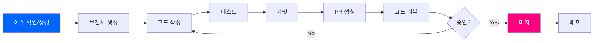
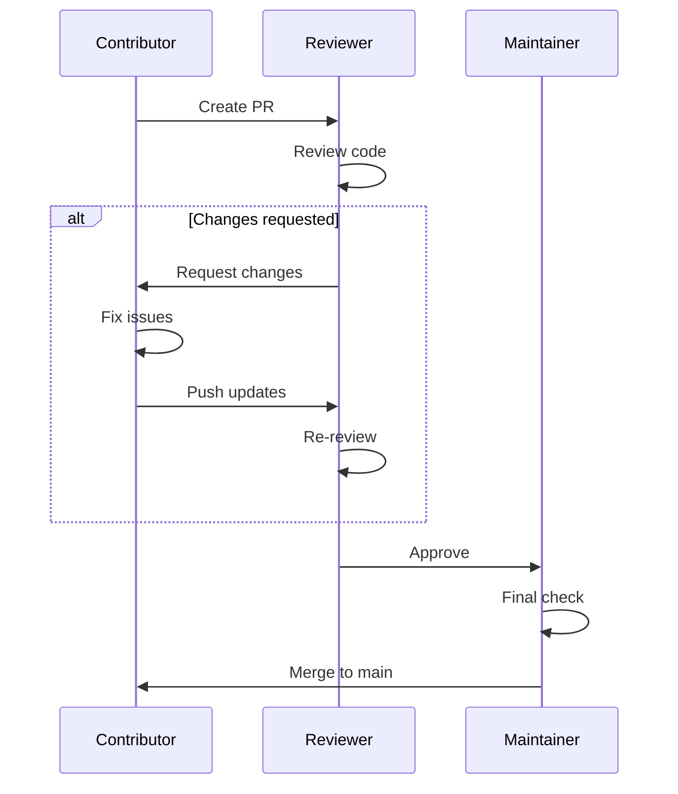

# CONTRIBUTING.md - Contribution Guidelines

---
title: 썸썸 (Thumb Some) - Contribution Guidelines
version: 1.0.0
status: Approved
owner: @development-team
created: 2025-12-01
updated: 2025-12-01
reviewers: [@lead-developer]
---

## 변경 이력 (Changelog)

| 버전 | 날짜 | 작성자 | 변경 내용 |
|------|------|--------|----------|
| 1.0.0 | 2025-12-01 | @development-team | 최초 작성 |

## 관련 문서

- [CONTEXT.md](./CONTEXT.md) - Project Context
- [CODE_REVIEW_GUIDE.md](./CODE_REVIEW_GUIDE.md) - Code Review Standards
- [VERSIONING_GUIDE.md](./VERSIONING_GUIDE.md) - Git Version Management
- [ENVIRONMENT.md](./ENVIRONMENT.md) - Development Environment Setup

---

## 📑 Table of Contents

1. [Welcome](#welcome)
2. [Code of Conduct](#code-of-conduct)
3. [Getting Started](#getting-started)
4. [Development Workflow](#development-workflow)
5. [Coding Standards](#coding-standards)
6. [Commit Guidelines](#commit-guidelines)
7. [Pull Request Process](#pull-request-process)
8. [Testing Requirements](#testing-requirements)
9. [Documentation](#documentation)
10. [Communication](#communication)

---

## 1. Welcome

👋 **썸썸(Thumb Some) 프로젝트에 기여해주셔서 감사합니다!**

이 문서는 프로젝트에 기여하기 위한 가이드라인을 제공합니다.
처음 기여하시는 분들도 쉽게 따라할 수 있도록 작성되었습니다.

### 1.1 기여 방법



### 1.2 기여 유형

| 기여 유형 | 설명 | 예시 |
|----------|------|------|
| **🐛 Bug Fix** | 버그 수정 | 터치 감지 오류 수정 |
| **✨ Feature** | 새로운 기능 추가 | 이심전심 텔레파시 모드 |
| **🎨 UI/UX** | 디자인 개선 | TDS 컬러 조정 |
| **📝 Documentation** | 문서 개선 | README 업데이트 |
| **⚡ Performance** | 성능 최적화 | 게임 루프 최적화 |
| **♻️ Refactoring** | 코드 리팩토링 | main.dart 모듈화 |
| **✅ Tests** | 테스트 추가 | 게임 로직 유닛 테스트 |

---

## 2. Code of Conduct

### 2.1 핵심 원칙

**Be Respectful** 🤝
- 모든 기여자를 존중합니다
- 건설적인 피드백을 제공합니다
- 다양한 의견을 환영합니다

**Be Collaborative** 🤝
- 팀워크를 중요하게 생각합니다
- 지식을 공유합니다
- 도움을 요청하고 제공합니다

**Be Professional** 💼
- 기술적 토론에 집중합니다
- 감정적 대응을 피합니다
- 품질을 최우선으로 합니다

### 2.2 금지 행위

❌ **절대 하지 말아야 할 것**:
- 개인 공격이나 모욕적 언어 사용
- 타인의 기여를 평가절하
- 스팸 또는 광고성 콘텐츠
- 민감한 정보(API 키, 비밀번호 등) 공개
- 저작권 침해

---

## 3. Getting Started

### 3.1 사전 준비

**필수 읽기**:
1. [README.md](./README.md) - 프로젝트 개요
2. [CONTEXT.md](./CONTEXT.md) - 프로젝트 컨텍스트
3. [ENVIRONMENT.md](./ENVIRONMENT.md) - 개발 환경 설정

**필수 도구**:
- Flutter SDK 3.16+
- Dart SDK 3.2+
- Git 2.30+
- IDE (VS Code 또는 Android Studio)

### 3.2 저장소 포크 및 클론

```bash
# 1. GitHub에서 저장소 포크
# https://github.com/x-ordo/some-some/fork

# 2. 포크한 저장소 클론
git clone https://github.com/[YOUR_USERNAME]/some-some.git
cd some-some

# 3. Upstream 원격 저장소 추가
git remote add upstream https://github.com/x-ordo/some-some.git

# 4. 의존성 설치
flutter pub get

# 5. Git hooks 설치 (자동 코드 포맷팅)
./scripts/setup-hooks.sh

# 6. 앱 실행하여 동작 확인
flutter run
```

**Git Hooks 정보**:
- Pre-commit hook이 자동으로 `dart format` 실행
- 모든 커밋이 자동으로 포맷팅되어 CI 통과 보장
- 자세한 내용: `.git/hooks/README.md` 참조

### 3.3 개발 환경 검증

```bash
# Flutter 환경 확인
flutter doctor -v

# 코드 분석
flutter analyze

# 테스트 실행 (Phase 2+)
flutter test

# 포맷 확인
dart format --set-exit-if-changed .
```

**Expected Output**:
```
✓ Flutter doctor: All checks passed
✓ flutter analyze: No issues found!
✓ All tests passed!
✓ No formatting changes needed
```

---

## 4. Development Workflow

### 4.1 이슈 선택

**Good First Issues** 👶

초보자를 위한 이슈는 `good first issue` 라벨이 붙어 있습니다:
- https://github.com/x-ordo/some-some/labels/good%20first%20issue

**이슈 확인**:
1. 이슈가 이미 할당되었는지 확인
2. 이슈에 코멘트로 작업 의사 표시
3. 메인테이너의 승인 대기 (24시간 이내)

### 4.2 브랜치 전략

**Branch Naming Convention**:

```
<type>/<short-description>

Examples:
feature/soul-sync-mode
fix/touch-detection-bug
refactor/extract-tds
docs/update-readme
test/game-logic-tests
```

**Type Prefixes**:
| Prefix | Description | Example |
|--------|-------------|---------|
| `feature/` | New feature | `feature/penalty-roulette` |
| `fix/` | Bug fix | `fix/haptic-feedback-android` |
| `refactor/` | Code refactoring | `refactor/game-state-riverpod` |
| `docs/` | Documentation | `docs/contributing-guide` |
| `test/` | Tests | `test/sticky-fingers-unit` |
| `chore/` | Build/config | `chore/upgrade-flutter-3.17` |

### 4.3 브랜치 생성

```bash
# 1. main 브랜치에서 최신 코드 pull
git checkout main
git pull upstream main

# 2. 새 브랜치 생성
git checkout -b feature/soul-sync-mode

# 3. 작업 시작!
```

### 4.4 코드 작성 (TDD Cycle)

**Phase 2+에서는 TDD 필수**:

```bash
# 🔴 RED: Write failing test
# test/features/soul_sync/soul_sync_test.dart

# 🟢 GREEN: Make test pass
# lib/features/soul_sync/soul_sync_screen.dart

# 🔵 REFACTOR: Clean up
dart format .
flutter analyze
```

**Example TDD Workflow**:

```dart
// 1️⃣ RED: test/features/soul_sync/soul_sync_test.dart
void main() {
  group('Soul Sync Question', () {
    test('should initialize with 20 questions', () {
      // Given
      final questions = SoulSyncQuestions.load();

      // When & Then
      expect(questions.length, equals(20));
    });

    test('should have valid question structure', () {
      // Given
      final question = Question(
        text: '이상형은?',
        optionA: '외모',
        optionB: '성격',
      );

      // When & Then
      expect(question.text, isNotEmpty);
      expect(question.optionA, isNotEmpty);
      expect(question.optionB, isNotEmpty);
    });
  });
}

// 2️⃣ GREEN: lib/features/soul_sync/models/question.dart
class Question {
  final String text;
  final String optionA;
  final String optionB;

  Question({
    required this.text,
    required this.optionA,
    required this.optionB,
  });
}

// 3️⃣ REFACTOR: Extract to repository, add validation
```

### 4.5 정기적 동기화

```bash
# Upstream 변경사항 가져오기
git fetch upstream

# Main 브랜치 최신화
git checkout main
git merge upstream/main

# Feature 브랜치에 변경사항 반영
git checkout feature/soul-sync-mode
git rebase main

# 충돌 발생 시 해결 후
git add .
git rebase --continue
```

---

## 5. Coding Standards

### 5.1 Dart Style Guide

**Flutter 공식 스타일 가이드 준수**:
- https://dart.dev/guides/language/effective-dart/style

**Auto-formatting**:

```bash
# 전체 파일 포맷팅
dart format .

# 특정 파일 포맷팅
dart format lib/features/soul_sync/

# 포맷팅 검증 (CI에서 사용)
dart format --set-exit-if-changed .
```

### 5.2 Naming Conventions

| Element | Convention | Example | ❌ Bad Example |
|---------|-----------|---------|---------------|
| **Class** | PascalCase | `GameScreen` | `game_screen` |
| **Function** | camelCase | `startGame()` | `StartGame()` |
| **Variable** | camelCase | `isPlaying` | `is_playing` |
| **Private** | `_camelCase` | `_gameLoop()` | `__gameLoop()` |
| **Constant** | camelCase | `gameDuration` | `GAME_DURATION` |
| **File** | snake_case | `game_screen.dart` | `GameScreen.dart` |

### 5.3 Code Quality Rules

**Mandatory Rules**:

| Rule | Threshold | Check Method |
|------|-----------|--------------|
| **Function Length** | ≤ 20 lines | Manual review |
| **Class Length** | ≤ 200 lines | Manual review |
| **File Length** | ≤ 400 lines | Manual review |
| **Nesting Depth** | ≤ 3 levels | Manual review |
| **Parameters** | ≤ 4 params | Manual review |
| **Cyclomatic Complexity** | ≤ 10 | Manual review |

**Example - Good vs Bad**:

```dart
// ❌ BAD: Too long, too complex
void processGame(int a, int b, int c, int d, int e) {
  if (a > 0) {
    if (b > 0) {
      if (c > 0) {
        if (d > 0) {
          // deeply nested logic
          for (int i = 0; i < e; i++) {
            // ...
          }
        }
      }
    }
  }
}

// ✅ GOOD: Short, focused, single responsibility
void startGame() {
  _validateGameState();
  _initializeTargets();
  _startGameTimer();
}

void _validateGameState() {
  if (!_canStartGame()) {
    throw GameStateError('Cannot start game');
  }
}

void _initializeTargets() {
  targetA = _calculateInitialPosition(centerX - 80);
  targetB = _calculateInitialPosition(centerX + 80);
}

void _startGameTimer() {
  _ticker.start();
  HapticFeedback.heavyImpact();
}
```

### 5.4 Comments Convention

**한국어 주석 OK for domain-specific terms**:

```dart
// ✅ GOOD: 도메인 용어는 한국어
class StickyFingersGame {
  // 쫀드기 챌린지 게임 로직
  void startChallenge() { ... }
}

// ✅ GOOD: 복잡한 알고리즘 설명
// Sin/Cos 조합으로 8자 경로를 생성합니다.
// targetA와 targetB가 서로 교차하도록 위상을 반대로 설정합니다.
Offset calculateTargetPosition() { ... }

// ❌ BAD: 불필요한 주석
// 게임을 시작합니다
void startGame() { ... }  // 함수 이름이 이미 명확함

// ❌ BAD: 오래된 주석
// TODO: 나중에 수정하기
void oldFunction() { ... }  // 작동하는 TODO는 삭제해야 함
```

**Dartdoc for Public APIs**:

```dart
/// 두 사람이 함께 플레이하는 쫀드기 챌린지 게임 화면입니다.
///
/// [duration] 파라미터로 게임 시간을 조정할 수 있습니다.
/// 기본값은 15초입니다.
///
/// Example:
/// ```dart
/// Navigator.push(
///   context,
///   MaterialPageRoute(
///     builder: (_) => GameScreen(duration: Duration(seconds: 20)),
///   ),
/// );
/// ```
class GameScreen extends StatefulWidget {
  /// 게임 지속 시간 (기본값: 15초)
  final Duration duration;

  const GameScreen({
    super.key,
    this.duration = const Duration(seconds: 15),
  });
}
```

### 5.5 Error Handling

**Always handle errors explicitly**:

```dart
// ✅ GOOD: Explicit error handling
Future<void> loadRemoteConfig() async {
  try {
    await _remoteConfig.fetchAndActivate();
  } on FirebaseException catch (e) {
    _logger.error('Failed to load remote config', error: e);
    // Fallback to local defaults
    _useLocalDefaults();
  } on SocketException catch (e) {
    _logger.error('Network error', error: e);
    _showNetworkError();
  } catch (e, stackTrace) {
    _logger.error('Unexpected error', error: e, stackTrace: stackTrace);
    rethrow;
  }
}

// ❌ BAD: Silent failure
Future<void> loadRemoteConfig() async {
  try {
    await _remoteConfig.fetchAndActivate();
  } catch (e) {
    // Do nothing - 사용자는 왜 실패했는지 모름
  }
}
```

---

## 6. Commit Guidelines

### 6.1 Commit Message Format

**Conventional Commits 준수**:

```
<type>(<scope>): <subject>

[optional body]

[optional footer]
```

**Examples**:

```bash
# ✅ GOOD
feat(game): add difficulty selection UI

Add 3 difficulty levels (Easy, Normal, Hard) with
visual indicators. Each level adjusts target speed
and movement intensity.

Closes #45

# ✅ GOOD
fix(haptic): resolve Android vibration permission issue

Add VIBRATE permission check for Android 6.0+.
Fallback to visual feedback if permission denied.

Fixes #67

# ❌ BAD
update game  # Too vague, no type, no scope

# ❌ BAD
feat: added some new features and fixed bugs  # Multiple changes in one commit
```

### 6.2 Commit Types

| Type | Description | Example |
|------|-------------|---------|
| `feat` | New feature | `feat(soul-sync): add compatibility quiz` |
| `fix` | Bug fix | `fix(touch): improve multi-touch detection` |
| `refactor` | Code restructuring | `refactor(tds): extract design system` |
| `test` | Add/modify tests | `test(game): add collision detection tests` |
| `docs` | Documentation | `docs(readme): update installation steps` |
| `style` | Code style (formatting) | `style: run dart format` |
| `perf` | Performance improvement | `perf(painter): optimize repaint calls` |
| `chore` | Build/dependencies | `chore(deps): upgrade flutter to 3.17` |

### 6.3 Commit Best Practices

**DO** ✅:
- Write clear, concise commit messages
- Use imperative mood ("add" not "added")
- Separate subject from body with blank line
- Reference issues/PRs in footer
- Keep commits atomic (one logical change)

**DON'T** ❌:
- Mix unrelated changes in one commit
- Commit broken/untested code
- Use vague messages ("update", "fix", "change")
- Include WIP commits in PR
- Commit secrets or sensitive data

**Atomic Commits Example**:

```bash
# ❌ BAD: Multiple changes
git commit -m "Add soul sync mode, fix bugs, update docs"

# ✅ GOOD: Separate commits
git commit -m "feat(soul-sync): add question model and repository"
git commit -m "feat(soul-sync): add UI screen and navigation"
git commit -m "fix(touch): improve collision detection threshold"
git commit -m "docs(soul-sync): add feature documentation"
```

### 6.4 Commit Signing (Optional)

**GPG Signing for verified commits**:

```bash
# Generate GPG key
gpg --full-generate-key

# List keys
gpg --list-secret-keys --keyid-format=long

# Configure Git
git config --global user.signingkey [KEY_ID]
git config --global commit.gpgsign true

# Commit with signature
git commit -S -m "feat(game): add new feature"
```

---

## 7. Pull Request Process

### 7.1 PR 생성 전 체크리스트

```markdown
## Before Creating PR

- [ ] 코드가 빌드되고 실행됩니다
- [ ] 모든 테스트가 통과합니다 (`flutter test`)
- [ ] Linter 이슈가 없습니다 (`flutter analyze`)
- [ ] 코드가 포맷되었습니다 (`dart format .`)
- [ ] 커밋 메시지가 규칙을 따릅니다
- [ ] 관련 이슈를 참조합니다
- [ ] 스크린샷/영상이 필요한 경우 첨부합니다
- [ ] 문서가 업데이트되었습니다 (필요 시)
```

### 7.2 PR 생성

```bash
# 1. 변경사항 푸시
git push origin feature/soul-sync-mode

# 2. GitHub에서 PR 생성
# https://github.com/x-ordo/some-some/compare

# 3. PR 템플릿 작성 (자동으로 로드됨)
```

### 7.3 PR Template

**자동으로 로드되는 템플릿** (`.github/PULL_REQUEST_TEMPLATE.md`):

```markdown
## 📝 Description

[작업 내용을 간단히 설명해주세요]

Closes #[이슈 번호]

## 🎯 Type of Change

- [ ] 🐛 Bug fix
- [ ] ✨ New feature
- [ ] 🎨 UI/UX improvement
- [ ] ⚡ Performance optimization
- [ ] ♻️ Refactoring
- [ ] 📝 Documentation
- [ ] ✅ Tests

## 📸 Screenshots/Videos

[UI 변경이 있는 경우 스크린샷/영상 첨부]

## ✅ Checklist

- [ ] 코드가 빌드되고 실행됩니다
- [ ] 모든 테스트가 통과합니다
- [ ] Linter 이슈가 없습니다
- [ ] 코드가 포맷되었습니다
- [ ] 커밋 메시지가 규칙을 따릅니다
- [ ] 문서가 업데이트되었습니다 (필요 시)

## 🧪 Test Plan

[테스트 방법을 설명해주세요]

1. ...
2. ...

## 📚 Related Issues/PRs

- Related to #[이슈 번호]
- Depends on #[PR 번호]
```

### 7.4 PR Review Process



**Review Timeline**:
- 첫 리뷰: **48시간 이내**
- 후속 리뷰: **24시간 이내**
- 승인 후 머지: **즉시**

### 7.5 Review 응답하기

**좋은 응답 예시**:

```markdown
> 이 함수가 너무 길어 보이는데, 분리할 수 있을까요?

✅ GOOD:
좋은 지적입니다! `_initializeGame()`, `_startTimer()`,
`_enableHaptic()`으로 분리하겠습니다.

Pushed in commit abc1234.

---

❌ BAD:
아니요, 이대로 괜찮습니다.
```

### 7.6 PR 머지 조건

**모든 조건 충족 시 머지 가능**:

1. ✅ 최소 1명의 Approval
2. ✅ 모든 CI 체크 통과
3. ✅ 충돌 없음 (Merge conflicts resolved)
4. ✅ Branch가 최신 main 기준
5. ✅ 모든 대화 Resolved

**Merge 방법**: Squash and Merge (기본값)

---

## 8. Testing Requirements

### 8.1 Test Coverage Goals

| Test Type | Current (MVP) | Target (Phase 2) | Priority |
|-----------|---------------|------------------|----------|
| **Unit Tests** | 0% | 80%+ | High |
| **Widget Tests** | 0% | 60%+ | Medium |
| **Integration Tests** | 0% | Critical Paths 100% | High |

### 8.2 테스트 작성 (Phase 2+)

**Test Structure**:

```dart
// test/features/game/game_logic_test.dart
void main() {
  group('GameLogic', () {
    late GameLogic gameLogic;

    setUp(() {
      gameLogic = GameLogic();
    });

    tearDown(() {
      gameLogic.dispose();
    });

    group('startGame', () {
      test('should initialize with correct duration', () {
        // Given
        const duration = Duration(seconds: 15);

        // When
        gameLogic.startGame(duration: duration);

        // Then
        expect(gameLogic.duration, equals(duration));
        expect(gameLogic.isPlaying, isTrue);
      });

      test('should throw error when already playing', () {
        // Given
        gameLogic.startGame();

        // When & Then
        expect(
          () => gameLogic.startGame(),
          throwsA(isA<GameStateError>()),
        );
      });
    });
  });
}
```

### 8.3 테스트 실행

```bash
# 모든 테스트 실행
flutter test

# 특정 파일 테스트
flutter test test/features/game/game_logic_test.dart

# 커버리지 리포트 생성
flutter test --coverage
genhtml coverage/lcov.info -o coverage/html
open coverage/html/index.html
```

### 8.4 Widget 테스트

```dart
// test/shared/widgets/toss_button_test.dart
void main() {
  testWidgets('TossButton should trigger callback on tap', (tester) async {
    // Given
    bool tapped = false;
    await tester.pumpWidget(
      MaterialApp(
        home: Scaffold(
          body: TossButton(
            text: 'Test Button',
            color: Colors.blue,
            onTap: () => tapped = true,
          ),
        ),
      ),
    );

    // When
    await tester.tap(find.text('Test Button'));
    await tester.pumpAndSettle();

    // Then
    expect(tapped, isTrue);
  });
}
```

---

## 9. Documentation

### 9.1 문서화 요구사항

**새 기능 추가 시 업데이트 필요**:

| 문서 | 업데이트 조건 | 예시 |
|------|-------------|------|
| **README.md** | 주요 기능 변경 | 새 게임 모드 추가 |
| **CONTEXT.md** | 아키텍처 변경 | 상태 관리 Riverpod 도입 |
| **plan.md** | 로드맵 변경 | 새 스프린트 추가 |
| **API_SPEC.md** | API 변경 | Firebase 함수 추가 |

### 9.2 코드 문서화

**Dartdoc for public APIs**:

```dart
/// 두 사람이 함께 플레이하는 쫀드기 챌린지 게임입니다.
///
/// [duration]으로 게임 지속 시간을 조정할 수 있습니다.
/// [difficulty]로 난이도를 선택할 수 있습니다.
///
/// Example:
/// ```dart
/// final game = StickyFingersGame(
///   duration: Duration(seconds: 20),
///   difficulty: Difficulty.hard,
/// );
/// game.start();
/// ```
class StickyFingersGame {
  /// 게임 지속 시간
  final Duration duration;

  /// 게임 난이도
  final Difficulty difficulty;

  /// Creates a new [StickyFingersGame] instance.
  StickyFingersGame({
    required this.duration,
    this.difficulty = Difficulty.normal,
  });
}
```

### 9.3 문서 검증

```bash
# Generate API documentation
dart doc .

# View generated docs
open doc/api/index.html
```

---

## 10. Communication

### 10.1 커뮤니케이션 채널

| 채널 | 용도 | 응답 시간 |
|------|------|----------|
| **GitHub Issues** | 버그 리포트, 기능 요청 | 48시간 |
| **GitHub Discussions** | 일반 토론, 질문 | 72시간 |
| **Pull Requests** | 코드 리뷰 | 48시간 |

### 10.2 이슈 작성

**버그 리포트 템플릿**:

```markdown
## 🐛 Bug Report

### 설명
[버그를 간단히 설명해주세요]

### 재현 방법
1. ...
2. ...
3. ...

### 예상 동작
[무엇이 일어나야 하는지]

### 실제 동작
[실제로 무엇이 일어나는지]

### 환경
- Device: [e.g. iPhone 15 Pro]
- OS: [e.g. iOS 17.0]
- App Version: [e.g. 1.0.0]

### 스크린샷
[가능하다면 첨부]
```

**기능 요청 템플릿**:

```markdown
## ✨ Feature Request

### 문제
[어떤 문제를 해결하고 싶으신가요?]

### 제안하는 해결책
[어떤 기능을 추가하면 좋을까요?]

### 대안
[고려한 다른 방법이 있나요?]

### 추가 컨텍스트
[기타 참고 사항]
```

### 10.3 질문하기

**좋은 질문 예시**:

```markdown
## ❓ Question: 게임 상태 관리 방법

안녕하세요! Phase 2에서 Riverpod을 도입한다고 했는데,
현재 MVP의 setState() 패턴에서 어떻게 마이그레이션하면 좋을까요?

제가 생각한 방법은:
1. GameStateNotifier 생성
2. 기존 GameScreen의 State를 Riverpod Provider로 전환

이 방향이 맞나요? 다른 제안이 있으시면 알려주세요!

---

✅ 구체적인 질문
✅ 자신의 생각 포함
✅ 명확한 컨텍스트
```

---

## 11. Recognition

### 11.1 기여자 인정

**모든 기여자는 README.md에 기록됩니다**:

```markdown
## Contributors

Thanks to these wonderful people:

- [@username1](https://github.com/username1) - Feature A
- [@username2](https://github.com/username2) - Bug fix B
- [@username3](https://github.com/username3) - Documentation C
```

### 11.2 기여 유형별 배지

| 배지 | 조건 | 예시 |
|------|------|------|
| 🥇 **Gold** | 10+ PR merged | Core contributor |
| 🥈 **Silver** | 5+ PR merged | Active contributor |
| 🥉 **Bronze** | 1+ PR merged | First-time contributor |

---

## 12. Frequently Asked Questions

### Q1: PR이 머지되는데 얼마나 걸리나요?

**A**: 첫 리뷰는 48시간 이내, 승인 후 즉시 머지됩니다.

### Q2: 테스트를 꼭 작성해야 하나요?

**A**: Phase 2부터는 **필수**입니다. MVP 단계에서는 선택사항입니다.

### Q3: 한국어로 커뮤니케이션해도 되나요?

**A**: 네! 이슈, PR, 코멘트 모두 한국어 OK입니다.

### Q4: 작은 오타 수정도 PR을 만들어야 하나요?

**A**: 네, 작은 변경도 PR로 제출해주세요. 빠르게 리뷰하겠습니다.

### Q5: 여러 이슈를 한 번에 해결해도 되나요?

**A**: 가능하면 이슈당 하나의 PR을 만들어주세요. 리뷰가 더 빠릅니다.

---

## 13. Getting Help

막히거나 질문이 있으신가요?

1. **문서 확인**: [CONTEXT.md](./CONTEXT.md), [ENVIRONMENT.md](./ENVIRONMENT.md)
2. **이슈 검색**: 비슷한 질문이 있는지 확인
3. **새 이슈 생성**: 궁금한 점을 자유롭게 질문하세요!

**We're here to help!** 🙌

---

**Thank you for contributing to 썸썸!** 💕

**Last Updated**: 2025-12-01
**Version**: 1.0.0
**Status**: ✅ Approved
