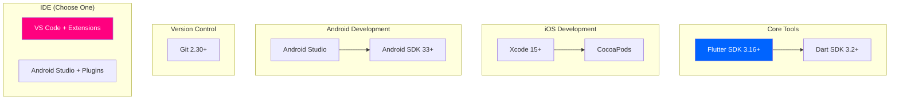

# ENVIRONMENT.md - Development Environment Setup

---
title: 썸썸 (Thumb Some) - Development Environment Setup Guide
version: 1.0.0
status: Approved
owner: @development-team
created: 2025-12-01
updated: 2025-12-01
reviewers: [@lead-developer]
---

## 변경 이력 (Changelog)

| 버전 | 날짜 | 작성자 | 변경 내용 |
|------|------|--------|----------|
| 1.0.0 | 2025-12-01 | @development-team | 최초 작성 |

## 관련 문서

- [CONTEXT.md](./CONTEXT.md) - Project Context
- [README.md](./README.md) - Quick Start Guide
- [CONTRIBUTING.md](./CONTRIBUTING.md) - Contribution Guidelines (Phase 2)

---

## 📑 Table of Contents

1. [Prerequisites](#prerequisites)
2. [Flutter SDK Setup](#flutter-sdk-setup)
3. [IDE Configuration](#ide-configuration)
4. [Project Setup](#project-setup)
5. [Platform-Specific Setup](#platform-specific-setup)
6. [Firebase Setup](#firebase-setup-phase-2)
7. [Troubleshooting](#troubleshooting)
8. [Verification](#verification)

---

## 1. Prerequisites

### 1.1 System Requirements

| Platform | Minimum | Recommended |
|----------|---------|-------------|
| **macOS** | 10.14 Mojave | 12+ Monterey |
| **Windows** | Windows 10 | Windows 11 |
| **Linux** | Ubuntu 18.04+ | Ubuntu 22.04+ |
| **RAM** | 8GB | 16GB+ |
| **Storage** | 10GB free | 50GB+ SSD |

### 1.2 Required Software



### 1.3 Version Check Commands

```bash
# Flutter & Dart
flutter --version
dart --version

# Git
git --version

# iOS (macOS only)
xcodebuild -version

# Android
android --version  # or check Android Studio
```

**Expected Output**:

```
Flutter 3.16.0 • channel stable
Dart 3.2.0 • DevTools 2.28.0
Git version 2.39.0
Xcode 15.0
```

---

## 2. Flutter SDK Setup

### 2.1 Installation

#### macOS

```bash
# 1. Download Flutter SDK
cd ~/development
git clone https://github.com/flutter/flutter.git -b stable

# 2. Add to PATH (add to ~/.zshrc or ~/.bash_profile)
export PATH="$PATH:$HOME/development/flutter/bin"

# 3. Apply changes
source ~/.zshrc

# 4. Verify installation
flutter doctor
```

#### Windows

```powershell
# 1. Download Flutter SDK
# Visit: https://docs.flutter.dev/get-started/install/windows
# Download flutter_windows_3.16.0-stable.zip

# 2. Extract to C:\src\flutter

# 3. Add to PATH (System Environment Variables)
# C:\src\flutter\bin

# 4. Verify installation
flutter doctor
```

#### Linux

```bash
# 1. Install prerequisites
sudo apt-get update
sudo apt-get install -y curl git unzip xz-utils zip libglu1-mesa

# 2. Download Flutter SDK
cd ~/development
git clone https://github.com/flutter/flutter.git -b stable

# 3. Add to PATH (add to ~/.bashrc)
export PATH="$PATH:$HOME/development/flutter/bin"

# 4. Apply changes
source ~/.bashrc

# 5. Verify installation
flutter doctor
```

### 2.2 Flutter Doctor

Run `flutter doctor` and resolve all issues:

```bash
flutter doctor -v
```

**Expected Output** (all ✅):

```
[✓] Flutter (Channel stable, 3.16.0)
[✓] Android toolchain - develop for Android devices
[✓] Xcode - develop for iOS and macOS
[✓] Chrome - develop for the web
[✓] Android Studio (version 2023.1)
[✓] VS Code (version 1.85)
[✓] Connected device (2 available)
[✓] Network resources
```

### 2.3 Flutter Configuration

```bash
# Enable web support (optional, for future)
flutter config --enable-web

# Disable analytics (optional)
flutter config --no-analytics

# Set up Android licenses
flutter doctor --android-licenses
```

---

## 3. IDE Configuration

### 3.1 VS Code Setup (Recommended)

#### Install VS Code

- Download: https://code.visualstudio.com/
- Version: 1.85+

#### Required Extensions

```bash
# Install extensions via command line
code --install-extension Dart-Code.dart-code
code --install-extension Dart-Code.flutter
code --install-extension usernamehw.errorlens
code --install-extension esbenp.prettier-vscode
code --install-extension ms-vscode.vscode-typescript-next
```

**Or install via UI**:

1. Open VS Code
2. Go to Extensions (⌘+Shift+X / Ctrl+Shift+X)
3. Search and install:
   - **Flutter** by Dart Code
   - **Dart** by Dart Code
   - **Error Lens** by Alexander
   - **Prettier** by Prettier
   - **GitLens** by GitKraken

#### VS Code Settings

Create `.vscode/settings.json`:

```json
{
  "dart.flutterSdkPath": "/Users/[your-username]/development/flutter",
  "dart.lineLength": 120,
  "editor.formatOnSave": true,
  "editor.rulers": [120],
  "editor.tabSize": 2,
  "files.associations": {
    "*.dart": "dart"
  },
  "[dart]": {
    "editor.defaultFormatter": "Dart-Code.dart-code",
    "editor.formatOnSave": true,
    "editor.selectionHighlight": false,
    "editor.suggest.snippetsPreventQuickSuggestions": false,
    "editor.suggestSelection": "first",
    "editor.tabCompletion": "onlySnippets",
    "editor.wordBasedSuggestions": "off"
  },
  "dart.debugExternalPackageLibraries": false,
  "dart.debugSdkLibraries": false,
  "flutter.hotReloadOnSave": true
}
```

#### Keyboard Shortcuts

Add to `.vscode/keybindings.json`:

```json
[
  {
    "key": "cmd+k cmd+r",
    "command": "flutter.hotReload",
    "when": "dart-code:flutterProjectLoaded"
  },
  {
    "key": "cmd+k cmd+shift+r",
    "command": "flutter.hotRestart",
    "when": "dart-code:flutterProjectLoaded"
  }
]
```

### 3.2 Android Studio Setup (Alternative)

#### Install Android Studio

- Download: https://developer.android.com/studio
- Version: 2023.1+ (Hedgehog)

#### Required Plugins

1. Go to **File → Settings → Plugins** (or **Preferences** on macOS)
2. Search and install:
   - **Flutter** (includes Dart)
   - **Rainbow Brackets**
   - **Key Promoter X**

#### Android Studio Settings

1. **File → Settings → Languages & Frameworks → Flutter**
   - Flutter SDK path: `/Users/[your-username]/development/flutter`

2. **File → Settings → Editor → Code Style → Dart**
   - Line length: 120

---

## 4. Project Setup

### 4.1 Clone Repository

```bash
# Clone repository
git clone https://github.com/x-ordo/some-some.git
cd some-some

# Check branch
git branch

# Expected output:
# * claude/create-project-docs-018PvgsgWVhb5gCJTehTAceb
```

### 4.2 Install Dependencies

```bash
# Install Flutter packages
flutter pub get

# Verify pubspec.yaml
cat pubspec.yaml
```

**Current `pubspec.yaml`** (MVP):

```yaml
name: thumb_some
description: 게임인 척하며 자연스럽게 손잡기
publish_to: 'none'
version: 1.0.0+1

environment:
  sdk: '>=3.2.0 <4.0.0'

dependencies:
  flutter:
    sdk: flutter

dev_dependencies:
  flutter_test:
    sdk: flutter
  flutter_lints: ^4.0.0

flutter:
  uses-material-design: true
```

### 4.3 Run Application

```bash
# List available devices
flutter devices

# Run on specific device
flutter run -d [device-id]

# Examples:
flutter run -d iPhone-15-Pro      # iOS Simulator
flutter run -d emulator-5554       # Android Emulator
flutter run -d chrome              # Web (if enabled)
```

**Hot Reload**:
- Press `r` in terminal (or `⌘+S` in VS Code)
- Hot reload reloads changed code without losing state

**Hot Restart**:
- Press `R` in terminal (or `⌘+Shift+R` in VS Code)
- Hot restart resets the app state

---

## 5. Platform-Specific Setup

### 5.1 iOS Setup (macOS Only)

#### Install Xcode

1. Download Xcode 15+ from App Store
2. Install Command Line Tools:

```bash
sudo xcode-select --switch /Applications/Xcode.app/Contents/Developer
sudo xcodebuild -runFirstLaunch
```

#### Install CocoaPods

```bash
# Install CocoaPods
sudo gem install cocoapods

# Verify installation
pod --version
```

#### Setup iOS Simulator

```bash
# List simulators
xcrun simctl list devices

# Open simulator
open -a Simulator

# Or use Flutter
flutter emulators --launch apple_ios_simulator
```

#### Code Signing (Real Device)

1. Open `ios/Runner.xcworkspace` in Xcode
2. Select **Runner** → **Signing & Capabilities**
3. Select your **Team**
4. Change **Bundle Identifier** to unique ID (e.g., `com.yourname.thumbsome`)

#### Build for iOS

```bash
# Run on simulator
flutter run -d "iPhone 15 Pro"

# Build IPA (requires Apple Developer account)
flutter build ios --release
```

### 5.2 Android Setup

#### Install Android Studio

1. Download from https://developer.android.com/studio
2. Run installer
3. Open Android Studio → **More Actions** → **SDK Manager**

#### Install Android SDK

Required SDK versions:
- **Android SDK Platform 33** (API 33, Android 13)
- **Android SDK Build-Tools 33.0.0**
- **Android Emulator**
- **Android SDK Platform-Tools**

```bash
# Verify installation
flutter doctor --android-licenses
```

#### Setup Android Emulator

1. Open Android Studio → **More Actions** → **Virtual Device Manager**
2. Click **Create Device**
3. Select **Pixel 6 Pro**
4. Select **System Image**: **Android 13 (API 33)**
5. Click **Finish**

**Or via command line**:

```bash
# List emulators
flutter emulators

# Launch emulator
flutter emulators --launch Pixel_6_Pro_API_33
```

#### Build for Android

```bash
# Run on emulator
flutter run -d emulator-5554

# Build APK
flutter build apk --release

# Build App Bundle (for Play Store)
flutter build appbundle --release
```

### 5.3 Device Debugging

#### Enable USB Debugging (Android)

1. On device: **Settings** → **About Phone**
2. Tap **Build Number** 7 times (Developer Mode enabled)
3. Go to **Settings** → **Developer Options**
4. Enable **USB Debugging**
5. Connect via USB
6. Allow USB debugging prompt

```bash
# Verify connection
adb devices

# Expected output:
# List of devices attached
# 1A2B3C4D5E6F    device
```

#### Trust Computer (iOS)

1. Connect iPhone via USB
2. Unlock device
3. Tap **Trust** on prompt
4. Enter passcode

```bash
# Verify connection
flutter devices

# Expected output:
# iPhone 15 Pro (mobile) • 00008101-001234567890123A • ios • iOS 17.0
```

---

## 6. Firebase Setup (Phase 2)

**Note**: Firebase는 Phase 2에서 추가됩니다. 현재 MVP에서는 불필요합니다.

### 6.1 Prerequisites

```bash
# Install Firebase CLI
npm install -g firebase-tools

# Login to Firebase
firebase login
```

### 6.2 Create Firebase Project

1. Go to https://console.firebase.google.com/
2. Click **Add Project**
3. Project name: `thumb-some`
4. Enable Google Analytics: **Yes**
5. Click **Create Project**

### 6.3 Add Flutter App to Firebase

#### iOS App

```bash
# Install FlutterFire CLI
dart pub global activate flutterfire_cli

# Configure Firebase for iOS
flutterfire configure
```

Select:
- iOS Bundle ID: `com.yourname.thumbsome`
- iOS App Nickname: `Thumb Some iOS`

#### Android App

```bash
# Configure Firebase for Android
flutterfire configure
```

Select:
- Android Package Name: `com.yourname.thumbsome`
- Android App Nickname: `Thumb Some Android`

### 6.4 Add Firebase Dependencies

Update `pubspec.yaml`:

```yaml
dependencies:
  flutter:
    sdk: flutter
  firebase_core: ^2.24.0
  firebase_analytics: ^10.8.0
  firebase_crashlytics: ^3.4.8
  firebase_remote_config: ^4.3.8
```

```bash
flutter pub get
```

### 6.5 Initialize Firebase

Update `lib/main.dart`:

```dart
import 'package:firebase_core/firebase_core.dart';
import 'firebase_options.dart';

void main() async {
  WidgetsFlutterBinding.ensureInitialized();
  await Firebase.initializeApp(
    options: DefaultFirebaseOptions.currentPlatform,
  );
  runApp(const ThumbSomeApp());
}
```

---

## 7. Troubleshooting

### 7.1 Common Issues

#### Issue: `flutter: command not found`

**Solution**:

```bash
# macOS/Linux
echo 'export PATH="$PATH:$HOME/development/flutter/bin"' >> ~/.zshrc
source ~/.zshrc

# Windows
# Add to System Environment Variables:
# C:\src\flutter\bin
```

#### Issue: `CocoaPods not installed`

**Solution**:

```bash
sudo gem install cocoapods
pod setup
```

#### Issue: `Android licenses not accepted`

**Solution**:

```bash
flutter doctor --android-licenses
# Press 'y' for all prompts
```

#### Issue: `Unable to locate Android SDK`

**Solution**:

```bash
# Set ANDROID_HOME environment variable
export ANDROID_HOME=$HOME/Library/Android/sdk  # macOS
export ANDROID_HOME=$HOME/Android/Sdk          # Linux

# Add to ~/.zshrc or ~/.bashrc
```

#### Issue: `Xcode build fails with 'Runner.app' not found`

**Solution**:

```bash
# Clean build
cd ios
pod deintegrate
pod install
cd ..
flutter clean
flutter pub get
flutter run
```

#### Issue: `Hot reload not working`

**Solution**:

```bash
# Hot restart instead
flutter run
# Press 'R' (capital R)
```

### 7.2 Performance Issues

#### Slow Build Times

```bash
# Clean project
flutter clean

# Clear pub cache
flutter pub cache repair

# Rebuild
flutter pub get
flutter run
```

#### Emulator Lag

**Android**:
1. Open **AVD Manager**
2. Edit emulator
3. **Advanced Settings** → **Boot option**: **Cold boot**
4. **Graphics**: **Hardware - GLES 2.0**

**iOS**:
```bash
# Reset simulator
xcrun simctl erase all
```

---

## 8. Verification

### 8.1 Environment Check

Run all checks:

```bash
# Flutter doctor
flutter doctor -v

# Dependency check
flutter pub get

# Analyze code
flutter analyze

# Run tests (when available)
flutter test
```

### 8.2 Build Verification

#### iOS

```bash
# Debug build
flutter build ios --debug --simulator

# Release build (requires signing)
flutter build ios --release
```

#### Android

```bash
# Debug APK
flutter build apk --debug

# Release APK
flutter build apk --release

# App Bundle
flutter build appbundle --release
```

### 8.3 Run Application

```bash
# Run on connected device
flutter run

# Run with verbose logging
flutter run -v

# Run in profile mode (performance testing)
flutter run --profile
```

**Expected Result**:

```
Launching lib/main.dart on iPhone 15 Pro in debug mode...
Running Xcode build...
 └─Compiling, linking and signing...                        2.5s
✓ Built build/ios/Debug-iphonesimulator/Runner.app.

🔥  To hot reload changes while running, press "r" or "R".
For a more detailed help message, press "h".
To quit, press "q".
```

### 8.4 Checklist

```markdown
## Environment Setup Checklist

### Prerequisites
- [ ] Flutter SDK 3.16+ installed
- [ ] Dart SDK 3.2+ installed
- [ ] Git installed

### iOS (macOS only)
- [ ] Xcode 15+ installed
- [ ] CocoaPods installed
- [ ] iOS Simulator working
- [ ] Command Line Tools configured

### Android
- [ ] Android Studio installed
- [ ] Android SDK 33+ installed
- [ ] Android Emulator created
- [ ] Android licenses accepted

### IDE
- [ ] VS Code OR Android Studio installed
- [ ] Flutter/Dart plugins installed
- [ ] Settings configured

### Project
- [ ] Repository cloned
- [ ] Dependencies installed (`flutter pub get`)
- [ ] App runs successfully (`flutter run`)
- [ ] Hot reload works

### Optional (Phase 2)
- [ ] Firebase CLI installed
- [ ] Firebase project created
- [ ] Firebase configured for iOS/Android
```

---

## 9. Quick Reference

### 9.1 Common Commands

```bash
# Development
flutter pub get              # Install dependencies
flutter run                  # Run app
flutter run -d [device]      # Run on specific device
flutter analyze              # Static analysis
flutter test                 # Run tests

# Build
flutter build apk            # Build Android APK
flutter build appbundle      # Build Android App Bundle
flutter build ios            # Build iOS app

# Clean
flutter clean                # Clean build artifacts
flutter pub cache repair     # Repair pub cache

# Device Management
flutter devices              # List connected devices
flutter emulators            # List available emulators
flutter emulators --launch [id]  # Launch emulator

# Diagnostics
flutter doctor               # Check environment
flutter doctor -v            # Verbose environment check
flutter --version            # Show Flutter version
```

### 9.2 Project Structure

```
thumb-some/
├── lib/
│   └── main.dart           # App entry point
├── test/                   # Unit tests (Phase 2)
├── android/                # Android native code
├── ios/                    # iOS native code
├── pubspec.yaml            # Dependencies
├── .gitignore              # Git ignore rules
└── README.md               # Project README
```

### 9.3 Useful Resources

| Resource | URL |
|----------|-----|
| **Flutter Docs** | https://docs.flutter.dev/ |
| **Dart Docs** | https://dart.dev/guides |
| **Flutter Packages** | https://pub.dev/ |
| **Flutter DevTools** | https://docs.flutter.dev/tools/devtools |
| **Toss Design System** | https://toss.im/career/article/tosss-core-values |

---

## 10. Next Steps

After completing environment setup:

1. **Read Project Documentation**:
   - [CONTEXT.md](./CONTEXT.md) - Understand project architecture
   - [PRD.md](./PRD.md) - Understand product requirements
   - [plan.md](./plan.md) - Understand development roadmap

2. **Explore Codebase**:
   - Read `lib/main.dart` (599 lines)
   - Understand TDS (Toss Design System)
   - Study game physics (Sin/Cos algorithm)

3. **Start Contributing** (Phase 2):
   - Read [CONTRIBUTING.md](./CONTRIBUTING.md)
   - Pick a task from [plan.md](./plan.md)
   - Create feature branch
   - Follow TDD cycle

---

**Last Updated**: 2025-12-01
**Version**: 1.0.0
**Status**: ✅ Approved
