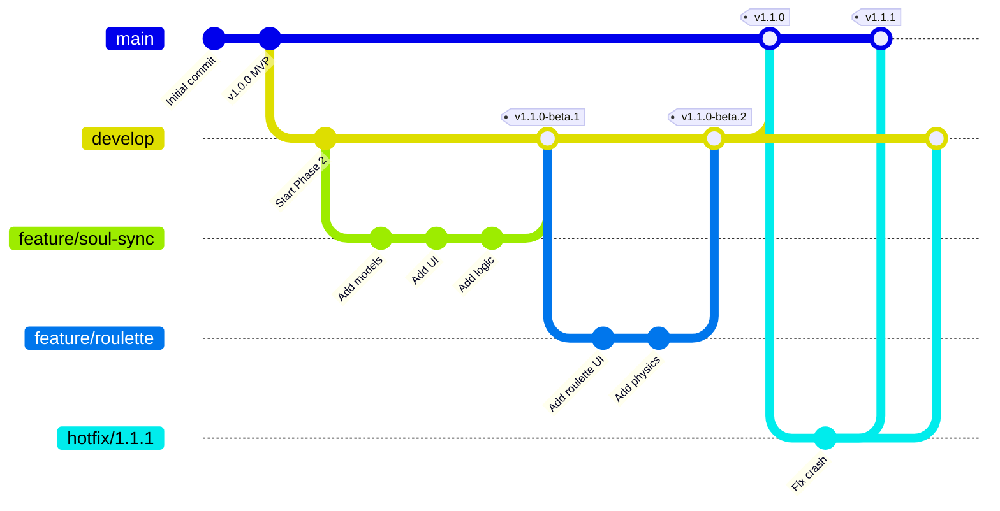
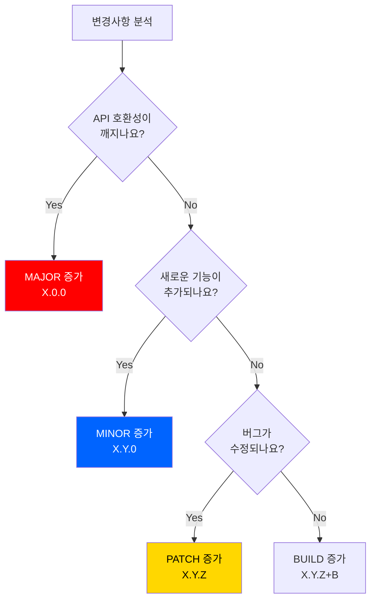
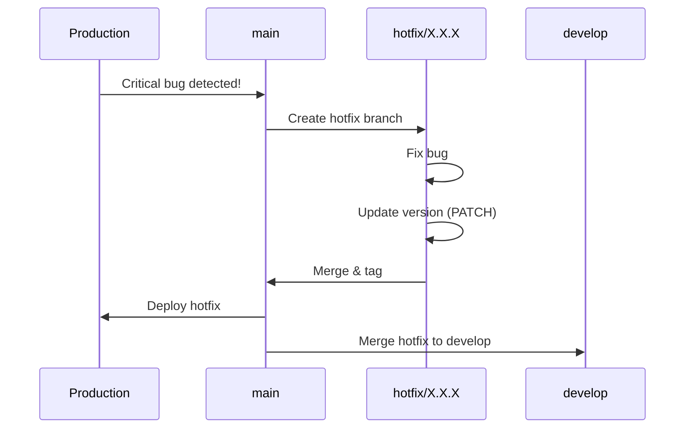

# VERSIONING_GUIDE.md - Git Version Management

---
title: 썸썸 (Thumb Some) - Git Version Management Guide
version: 1.0.0
status: Approved
owner: @development-team
created: 2025-12-01
updated: 2025-12-01
reviewers: [@lead-developer]
---

## 변경 이력 (Changelog)

| 버전 | 날짜 | 작성자 | 변경 내용 |
|------|------|--------|----------|
| 1.0.0 | 2025-12-01 | @development-team | 최초 작성 |

## 관련 문서

- [CONTRIBUTING.md](./CONTRIBUTING.md) - Contribution Guidelines
- [CODE_REVIEW_GUIDE.md](./CODE_REVIEW_GUIDE.md) - Code Review Standards
- [CONTEXT.md](./CONTEXT.md) - Project Context

---

## 📑 Table of Contents

1. [Purpose](#purpose)
2. [Semantic Versioning](#semantic-versioning)
3. [Branch Strategy](#branch-strategy)
4. [Release Process](#release-process)
5. [Hotfix Process](#hotfix-process)
6. [Changelog Management](#changelog-management)
7. [Tag Management](#tag-management)
8. [Best Practices](#best-practices)

---

## 1. Purpose

### 1.1 Why Version Management?

**추적 가능성** 📊
- 어떤 기능이 언제 배포되었는지 명확히
- 버그 발생 시 원인 추적 용이
- 롤백 시 정확한 버전 지정 가능

**팀 협업** 🤝
- 일관된 워크플로우
- 명확한 책임 소재
- 효율적인 병렬 작업

**사용자 신뢰** 💝
- 체계적인 버전 관리
- 명확한 릴리즈 노트
- 안정적인 배포 주기

### 1.2 Version Control Flow



---

## 2. Semantic Versioning

### 2.1 Version Format

**Semantic Versioning 2.0.0 준수**: https://semver.org/

```
MAJOR.MINOR.PATCH[-PRERELEASE][+BUILD]

Examples:
  1.0.0           # Initial release
  1.1.0           # New feature
  1.1.1           # Bug fix
  1.1.0-beta.1    # Beta release
  2.0.0           # Breaking change
  2.0.0+20250101  # Build metadata
```

### 2.2 Version Components

| Component | Description | When to Increment | Example |
|-----------|-------------|-------------------|---------|
| **MAJOR** | Breaking changes | API 호환성 깨짐 | 1.x.x → 2.0.0 |
| **MINOR** | New features | 하위 호환되는 기능 추가 | 1.0.x → 1.1.0 |
| **PATCH** | Bug fixes | 하위 호환되는 버그 수정 | 1.0.0 → 1.0.1 |
| **PRERELEASE** | Pre-release versions | 베타/알파 테스트 | 1.1.0-beta.1 |
| **BUILD** | Build metadata | 빌드 번호 추가 | 1.0.0+001 |

### 2.3 Version Decision Tree



### 2.4 Version Examples (썸썸 프로젝트)

| Version | Changes | Reason |
|---------|---------|--------|
| **1.0.0** | MVP 출시 (쫀드기 챌린지) | Initial release |
| **1.1.0** | 이심전심 텔레파시 모드 추가 | New feature (MINOR) |
| **1.1.1** | Android 햅틱 버그 수정 | Bug fix (PATCH) |
| **1.2.0** | 복불복 룰렛 모드 추가 | New feature (MINOR) |
| **1.2.1** | 터치 감지 개선 | Bug fix (PATCH) |
| **2.0.0** | Riverpod 상태 관리 도입 (API 변경) | Breaking change (MAJOR) |
| **2.0.0-beta.1** | 2.0.0 베타 테스트 | Pre-release |
| **2.0.0+20250101** | 2.0.0 프로덕션 빌드 | Build metadata |

---

## 3. Branch Strategy

### 3.1 Branch Types

**Permanent Branches**:

```
main              # Production-ready code (항상 배포 가능)
develop           # Integration branch (다음 릴리즈 준비)
```

**Temporary Branches**:

```
feature/*         # New features
fix/*             # Bug fixes
refactor/*        # Code refactoring
hotfix/*          # Production hotfixes
release/*         # Release preparation
```

### 3.2 Branch Naming Convention

**Format**:

```
<type>/<short-description>[-issue-number]

Examples:
  feature/soul-sync-mode
  feature/penalty-roulette-45
  fix/touch-detection-67
  refactor/extract-tds
  hotfix/critical-crash-89
  release/1.1.0
```

**Type Prefixes**:

| Prefix | Purpose | Base Branch | Merge To |
|--------|---------|-------------|----------|
| `feature/` | New features | `develop` | `develop` |
| `fix/` | Bug fixes | `develop` | `develop` |
| `refactor/` | Code refactoring | `develop` | `develop` |
| `hotfix/` | Production hotfixes | `main` | `main` + `develop` |
| `release/` | Release preparation | `develop` | `main` + `develop` |

### 3.3 Branch Lifecycle

**Feature Branch**:

```bash
# 1. Create from develop
git checkout develop
git pull origin develop
git checkout -b feature/soul-sync-mode

# 2. Develop & commit
git add .
git commit -m "feat(soul-sync): add question model"

# 3. Push to remote
git push -u origin feature/soul-sync-mode

# 4. Create PR to develop
# (via GitHub UI)

# 5. After merge, delete branch
git branch -d feature/soul-sync-mode
git push origin --delete feature/soul-sync-mode
```

**Release Branch**:

```bash
# 1. Create from develop
git checkout develop
git pull origin develop
git checkout -b release/1.1.0

# 2. Update version & changelog
# - pubspec.yaml: version: 1.1.0+10
# - CHANGELOG.md: Add release notes

git add pubspec.yaml CHANGELOG.md
git commit -m "chore(release): prepare v1.1.0"

# 3. Merge to main
git checkout main
git merge --no-ff release/1.1.0
git tag -a v1.1.0 -m "Release v1.1.0"
git push origin main --tags

# 4. Merge back to develop
git checkout develop
git merge --no-ff release/1.1.0
git push origin develop

# 5. Delete release branch
git branch -d release/1.1.0
```

**Hotfix Branch**:

```bash
# 1. Create from main
git checkout main
git pull origin main
git checkout -b hotfix/critical-crash

# 2. Fix & commit
git add .
git commit -m "fix(game): resolve null pointer crash"

# 3. Update version (PATCH)
# pubspec.yaml: 1.1.0 → 1.1.1

git add pubspec.yaml
git commit -m "chore(release): bump version to 1.1.1"

# 4. Merge to main
git checkout main
git merge --no-ff hotfix/critical-crash
git tag -a v1.1.1 -m "Hotfix v1.1.1"
git push origin main --tags

# 5. Merge to develop
git checkout develop
git merge --no-ff hotfix/critical-crash
git push origin develop

# 6. Delete hotfix branch
git branch -d hotfix/critical-crash
```

---

## 4. Release Process

### 4.1 Release Types

| Type | Schedule | From | To | Example |
|------|----------|------|----|---------|
| **Major Release** | 6-12개월 | `develop` | `main` | 1.x.x → 2.0.0 |
| **Minor Release** | 1-2개월 | `develop` | `main` | 1.0.x → 1.1.0 |
| **Patch Release** | 1-2주 | `develop` | `main` | 1.0.0 → 1.0.1 |
| **Hotfix Release** | Immediate | `main` | `main` | 1.0.0 → 1.0.1 |

### 4.2 Release Checklist

```markdown
## Pre-Release Checklist

### Code Quality
- [ ] 모든 테스트 통과 (`flutter test`)
- [ ] Linter 이슈 없음 (`flutter analyze`)
- [ ] 코드 포맷팅 완료 (`dart format .`)
- [ ] 코드 리뷰 완료

### Documentation
- [ ] CHANGELOG.md 업데이트
- [ ] README.md 업데이트 (필요 시)
- [ ] API 문서 업데이트 (필요 시)
- [ ] 릴리즈 노트 작성

### Version Management
- [ ] pubspec.yaml 버전 업데이트
- [ ] iOS version (ios/Runner/Info.plist)
- [ ] Android version (android/app/build.gradle)

### Testing
- [ ] 실기기 테스트 (iOS/Android)
- [ ] 다양한 화면 크기 테스트
- [ ] 네트워크 오류 시나리오 테스트
- [ ] 업그레이드 시나리오 테스트

### App Store Preparation
- [ ] 스크린샷 준비 (5개)
- [ ] App Store/Play Store 설명 업데이트
- [ ] 개인정보처리방침 업데이트 (필요 시)

### Build
- [ ] iOS Release 빌드 (`flutter build ios --release`)
- [ ] Android Release 빌드 (`flutter build appbundle --release`)
- [ ] 빌드 크기 확인 (<10MB 권장)

### Deployment
- [ ] TestFlight 배포 (iOS)
- [ ] Internal Testing 배포 (Android)
- [ ] Beta 테스터 피드백 수집
- [ ] 프로덕션 배포

### Post-Release
- [ ] Git 태그 생성
- [ ] GitHub Release 생성
- [ ] 팀에 공지
- [ ] 사용자에게 공지
```

### 4.3 Release Process (Step-by-Step)

**Step 1: Create Release Branch**

```bash
git checkout develop
git pull origin develop
git checkout -b release/1.1.0
```

**Step 2: Update Version**

```yaml
# pubspec.yaml
name: thumb_some
version: 1.1.0+11  # version+build_number
```

```xml
<!-- ios/Runner/Info.plist -->
<key>CFBundleShortVersionString</key>
<string>1.1.0</string>
<key>CFBundleVersion</key>
<string>11</string>
```

```gradle
// android/app/build.gradle
android {
    defaultConfig {
        versionCode 11
        versionName "1.1.0"
    }
}
```

**Step 3: Update CHANGELOG.md**

```markdown
# Changelog

All notable changes to this project will be documented in this file.

## [1.1.0] - 2025-02-01

### Added
- 이심전심 텔레파시 모드 추가
- 20개의 궁합 테스트 질문
- 궁합 점수 계산 알고리즘

### Changed
- 메인 화면 UI 개선
- 게임 로딩 속도 20% 향상

### Fixed
- Android 햅틱 권한 이슈 수정
- 작은 화면에서 레이아웃 깨짐 수정

## [1.0.0] - 2025-01-01

### Added
- 쫀드기 챌린지 게임 모드
- TDS 디자인 시스템
- 햅틱 피드백
```

**Step 4: Create Git Tag**

```bash
git add pubspec.yaml CHANGELOG.md
git commit -m "chore(release): prepare v1.1.0"

git checkout main
git merge --no-ff release/1.1.0

git tag -a v1.1.0 -m "Release v1.1.0

## Features
- 이심전심 텔레파시 모드
- 궁합 점수 계산

## Improvements
- 메인 화면 UI 개선
- 게임 로딩 속도 향상

## Bug Fixes
- Android 햅틱 권한 이슈
- 작은 화면 레이아웃 수정"

git push origin main --tags
```

**Step 5: Merge to Develop**

```bash
git checkout develop
git merge --no-ff release/1.1.0
git push origin develop

git branch -d release/1.1.0
```

**Step 6: Create GitHub Release**

```bash
# GitHub UI 또는 gh CLI
gh release create v1.1.0 \
  --title "v1.1.0 - Soul Sync Mode" \
  --notes-file RELEASE_NOTES.md
```

---

## 5. Hotfix Process

### 5.1 When to Hotfix?

**Hotfix Criteria** 🚨:

| Severity | Description | Response Time | Example |
|----------|-------------|---------------|---------|
| **Critical** | 앱 크래시, 데이터 손실 | Immediate | Null pointer crash |
| **High** | 주요 기능 불가 | 24시간 | 게임 시작 불가 |
| **Medium** | 일부 기능 오작동 | 1주일 | 햅틱 작동 안 함 |
| **Low** | UI 버그 | 다음 릴리즈 | 텍스트 오타 |

**Hotfix Only If**:
- ✅ Critical/High severity
- ✅ Production에 영향
- ✅ 즉시 수정 필요

**Regular Release If**:
- ⏰ Medium/Low severity
- ⏰ 다음 릴리즈에 포함 가능

### 5.2 Hotfix Workflow



### 5.3 Hotfix Example

**Scenario**: 프로덕션에서 게임 시작 시 크래시 발생

```bash
# 1. Create hotfix branch from main
git checkout main
git pull origin main
git checkout -b hotfix/1.1.1

# 2. Fix the bug
# lib/features/game/game_screen.dart
# Fix null pointer exception

git add lib/features/game/game_screen.dart
git commit -m "fix(game): resolve null pointer crash on game start

- Add null check before accessing user data
- Add fallback to default values

Fixes #89"

# 3. Update version
# pubspec.yaml: 1.1.0 → 1.1.1

git add pubspec.yaml
git commit -m "chore(release): bump version to 1.1.1"

# 4. Update CHANGELOG.md
echo "## [1.1.1] - 2025-02-05

### Fixed
- 게임 시작 시 크래시 수정 (null pointer exception)
" >> CHANGELOG.md

git add CHANGELOG.md
git commit -m "docs(changelog): update for v1.1.1"

# 5. Merge to main
git checkout main
git merge --no-ff hotfix/1.1.1
git tag -a v1.1.1 -m "Hotfix v1.1.1: Fix game start crash"
git push origin main --tags

# 6. Merge to develop
git checkout develop
git merge --no-ff hotfix/1.1.1
git push origin develop

# 7. Delete hotfix branch
git branch -d hotfix/1.1.1

# 8. Deploy immediately
flutter build appbundle --release
flutter build ios --release
```

---

## 6. Changelog Management

### 6.1 Changelog Format

**Keep a Changelog 준수**: https://keepachangelog.com/

```markdown
# Changelog

All notable changes to this project will be documented in this file.

The format is based on [Keep a Changelog](https://keepachangelog.com/en/1.0.0/),
and this project adheres to [Semantic Versioning](https://semver.org/spec/v2.0.0.html).

## [Unreleased]

### Added
- 레벨 선택 UI 개발 중

## [1.1.0] - 2025-02-01

### Added
- 이심전심 텔레파시 모드
- 궁합 점수 계산 알고리즘
- Firebase Remote Config 연동

### Changed
- 메인 화면 UI 개선
- 게임 로딩 속도 20% 향상

### Deprecated
- 구 버전 API (v2.0.0에서 제거 예정)

### Removed
- 사용되지 않는 테스트 데이터

### Fixed
- Android 햅틱 권한 이슈 (#67)
- 작은 화면 레이아웃 깨짐 (#72)

### Security
- API 키 하드코딩 제거

## [1.0.1] - 2025-01-15

### Fixed
- iOS에서 게임 종료 시 크래시 (#45)

## [1.0.0] - 2025-01-01

### Added
- 쫀드기 챌린지 게임 모드
- TDS 디자인 시스템
- 햅틱 피드백 시스템
- 성공/실패 결과 화면

[Unreleased]: https://github.com/x-ordo/some-some/compare/v1.1.0...HEAD
[1.1.0]: https://github.com/x-ordo/some-some/compare/v1.0.1...v1.1.0
[1.0.1]: https://github.com/x-ordo/some-some/compare/v1.0.0...v1.0.1
[1.0.0]: https://github.com/x-ordo/some-some/releases/tag/v1.0.0
```

### 6.2 Changelog Categories

| Category | Description | Example |
|----------|-------------|---------|
| **Added** | 새로운 기능 | "복불복 룰렛 모드 추가" |
| **Changed** | 기존 기능 변경 | "게임 난이도 조정" |
| **Deprecated** | 곧 제거될 기능 | "구 버전 API (v2.0.0에서 제거)" |
| **Removed** | 제거된 기능 | "미사용 테스트 데이터 삭제" |
| **Fixed** | 버그 수정 | "터치 감지 오류 수정" |
| **Security** | 보안 수정 | "API 키 노출 제거" |

---

## 7. Tag Management

### 7.1 Tag Naming

**Format**:

```
v<MAJOR>.<MINOR>.<PATCH>[-PRERELEASE]

Examples:
  v1.0.0
  v1.1.0
  v1.1.0-beta.1
  v2.0.0-alpha.1
```

### 7.2 Creating Tags

**Lightweight Tag** (간단한 마커):

```bash
git tag v1.0.0
git push origin v1.0.0
```

**Annotated Tag** (권장):

```bash
git tag -a v1.0.0 -m "Release v1.0.0

## Features
- Feature A
- Feature B

## Bug Fixes
- Fix #123"

git push origin v1.0.0
```

**Signing Tags** (보안 강화):

```bash
git tag -s v1.0.0 -m "Release v1.0.0"
git push origin v1.0.0
```

### 7.3 Tag Operations

```bash
# List all tags
git tag

# List tags matching pattern
git tag -l "v1.*"

# Show tag details
git show v1.0.0

# Delete local tag
git tag -d v1.0.0

# Delete remote tag
git push origin --delete v1.0.0

# Checkout specific tag
git checkout v1.0.0

# Create branch from tag
git checkout -b hotfix/1.0.1 v1.0.0
```

---

## 8. Best Practices

### 8.1 Do's ✅

**Version Management**:
- ✅ Semantic Versioning 엄격히 준수
- ✅ CHANGELOG.md 모든 릴리즈마다 업데이트
- ✅ Annotated Git Tags 사용
- ✅ 버전 번호와 태그 일치

**Branch Management**:
- ✅ Feature 브랜치는 짧게 유지 (1-2주)
- ✅ 정기적으로 develop 브랜치 동기화
- ✅ Merge 후 브랜치 삭제
- ✅ Main 브랜치는 항상 배포 가능 상태 유지

**Release Process**:
- ✅ Release 체크리스트 완료
- ✅ Beta 테스트 진행
- ✅ 릴리즈 노트 작성
- ✅ 팀에 사전 공지

### 8.2 Don'ts ❌

**Anti-Patterns**:
- ❌ Main 브랜치에 직접 커밋
- ❌ 버전 번호 건너뛰기 (1.0.0 → 1.2.0)
- ❌ Hotfix를 develop에서 생성
- ❌ Release 브랜치에서 새 기능 개발
- ❌ CHANGELOG 누락
- ❌ 태그 없이 배포
- ❌ Force push to main/develop

### 8.3 Emergency Procedures

**만약 실수로 Main에 직접 푸시했다면**:

```bash
# ⚠️ 조심! 팀과 먼저 논의하세요

# 1. Revert commit (권장)
git revert [commit-hash]
git push origin main

# 2. Reset (위험! 팀 전체에 영향)
git reset --hard [previous-commit]
git push --force origin main  # 절대 하지 마세요!
```

**잘못된 태그를 푸시했다면**:

```bash
# 1. Delete remote tag
git push origin --delete v1.0.0

# 2. Delete local tag
git tag -d v1.0.0

# 3. Create correct tag
git tag -a v1.0.0 -m "Correct message"

# 4. Push new tag
git push origin v1.0.0
```

---

## 9. Quick Reference

### 9.1 Common Commands

```bash
# Version Management
git tag                                    # List tags
git tag -a v1.0.0 -m "Release v1.0.0"      # Create tag
git push origin v1.0.0                     # Push tag

# Branch Management
git checkout -b feature/new-feature        # Create branch
git branch -d feature/new-feature          # Delete local branch
git push origin --delete feature/name      # Delete remote branch

# Release Process
git checkout -b release/1.1.0 develop      # Create release branch
git merge --no-ff release/1.1.0            # Merge with no fast-forward
git tag -a v1.1.0 -m "Release v1.1.0"      # Tag release

# Hotfix Process
git checkout -b hotfix/1.1.1 main          # Create hotfix
git merge --no-ff hotfix/1.1.1             # Merge hotfix
```

### 9.2 Version Bump Checklist

```markdown
## Quick Version Bump

- [ ] Update `pubspec.yaml` version
- [ ] Update `ios/Runner/Info.plist` (iOS)
- [ ] Update `android/app/build.gradle` (Android)
- [ ] Update `CHANGELOG.md`
- [ ] Commit: `chore(release): bump version to X.X.X`
- [ ] Create Git tag: `git tag -a vX.X.X`
- [ ] Push: `git push origin main --tags`
```

---

## 10. Resources

### 10.1 External Resources

- **Semantic Versioning**: https://semver.org/
- **Keep a Changelog**: https://keepachangelog.com/
- **Git Flow**: https://nvie.com/posts/a-successful-git-branching-model/
- **Conventional Commits**: https://www.conventionalcommits.org/

### 10.2 Internal Resources

- [CONTRIBUTING.md](./CONTRIBUTING.md) - How to contribute
- [CODE_REVIEW_GUIDE.md](./CODE_REVIEW_GUIDE.md) - Code review standards
- [plan.md](./plan.md) - Development roadmap

---

**Happy Versioning!** 🎉

**Last Updated**: 2025-12-01
**Version**: 1.0.0
**Status**: ✅ Approved
